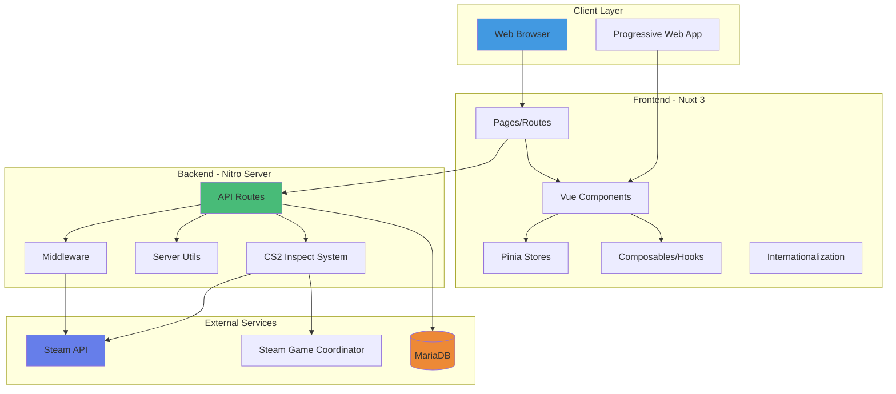
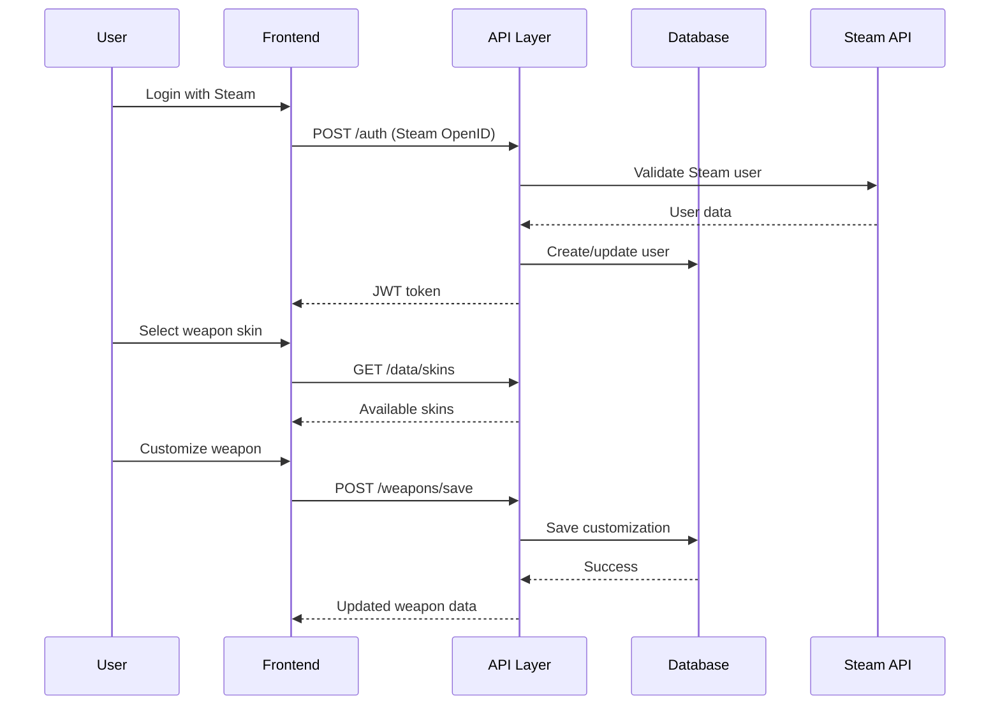
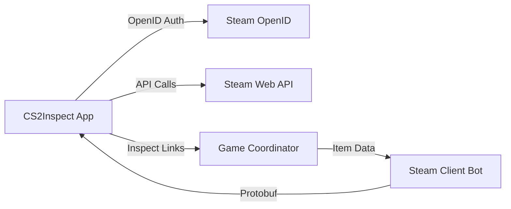

# Architecture

## System Overview

CS2Inspect is a full-stack web application built with Nuxt 3 that allows Counter-Strike 2 players to customize and manage their in-game item loadouts. The application provides a comprehensive interface for weapon skins, knives, gloves, agents, music kits, and pins customization with real-time preview capabilities.

## Technology Stack

### Frontend
- **Framework**: Nuxt 3 (Vue 3 + TypeScript)
- **UI Library**: Naive UI
- **Styling**: Tailwind CSS with custom SASS
- **State Management**: Pinia
- **Internationalization**: nuxt-i18n-micro (English, German, Russian)
- **Icons**: Iconify + Material Design Icons

### Backend
- **Runtime**: Node.js with Nitro server
- **Database**: MariaDB (MySQL compatible)
- **Authentication**: Steam OpenID + JWT
- **CS2 Integration**: 
  - `cs2-inspect-lib` - CS2 item inspection
  - `node-cs2` - Steam Game Coordinator integration
  - `csgo-fade-percentage-calculator` - Fade pattern calculations

### DevOps
- **Build System**: Vite
- **Testing**: Vitest + Vue Test Utils
- **Linting**: ESLint
- **Package Manager**: npm
- **Containerization**: Docker + Docker Compose
- **Deployment**: Vercel (configured)

## High-Level Architecture



## Core Architecture Components

### 1. Frontend Architecture

#### Page Structure
```
pages/
├── index.vue           # Main dashboard/loadout management
├── weapons/
│   └── [type].vue     # Dynamic weapon customization pages
├── knifes/
│   └── index.vue      # Knife customization page
├── gloves/
│   └── index.vue      # Glove customization page
├── agents/
│   └── index.vue      # Agent selection page
├── music-kits/
│   └── index.vue      # Music kit selection page
└── pins/
    └── index.vue      # Pin collection page
```

#### Component Architecture
```
components/
├── WeaponSkinModal.vue        # Weapon skin selection & customization
├── KnifeSkinModal.vue         # Knife skin selection & customization
├── GloveSkinModal.vue         # Glove skin selection & customization
├── StickerModal.vue           # Sticker application
├── KeychainModal.vue          # Keychain attachment
├── VisualCustomizerModal.vue  # Advanced visual customization
├── InspectItemDisplay.vue     # Item preview display
├── LoadoutSelector.vue        # Loadout management
├── ThemeProvider.vue          # Theme configuration
└── [Various Tab Components]   # Item category tabs
```

#### State Management (Pinia)
```typescript
stores/
└── loadoutStore.ts    # Manages user loadouts, weapons, knives, gloves
                       # Handles persistence to database
                       # Manages active loadout selection
```

#### Composables
```typescript
composables/
├── useInspectItem.ts  # Handles CS2 inspect URL processing
│                      # Item data parsing and validation
│                      # LocalStorage persistence
└── useItems.ts        # Item data fetching and caching
```

### 2. Backend Architecture

#### API Structure
```
server/api/
├── auth/
│   └── validate.ts           # JWT token validation
├── data/
│   ├── skins.ts             # Weapon/knife skin data
│   ├── agents.ts            # Agent data
│   ├── stickers.ts          # Sticker data
│   ├── keychains.ts         # Keychain data
│   ├── musickits.ts         # Music kit data
│   └── collectibles.ts      # Pins and other collectibles
├── weapons/
│   ├── [type].ts            # Get weapons by type
│   └── save.ts              # Save weapon customization
├── knifes/
│   ├── index.ts             # Get knives
│   └── save.ts              # Save knife customization
├── gloves/
│   ├── index.ts             # Get gloves
│   └── save.ts              # Save glove customization
├── loadouts/
│   ├── index.ts             # Get/create loadouts
│   └── select.ts            # Switch active loadout
├── pins/
│   └── index.ts             # Pin management
└── inspect.ts               # CS2 inspect URL processing
```

#### CS2 Inspect System
```
server/utils/csinspect/
├── base.ts                  # URL parsing and analysis
├── steamClient.ts           # Steam client connection management
├── protobuf-decoder.ts      # Decode masked inspect URLs
├── protobuf-writer.ts       # Generate masked inspect URLs
└── crc32.ts                 # CRC32 checksum validation
```

### 3. Database Schema

#### Core Tables
```sql
wp_player_loadouts          # User loadout configurations
wp_player_weapons           # Weapon customizations per loadout
wp_player_knifes            # Knife customizations per loadout
wp_player_gloves            # Glove customizations per loadout
wp_player_agents            # Agent selections per loadout
wp_player_pins              # Pin collections per loadout
```

#### Data Flow


## Security Architecture

### Authentication Flow
1. **Steam OpenID**: Users authenticate via Steam's OpenID protocol
2. **JWT Tokens**: Server issues JWT tokens (7-day expiry by default)
3. **Token Validation**: Middleware validates tokens on protected routes
4. **Session Management**: Tokens stored client-side (secure cookies)

### Data Protection
- Environment variables for sensitive credentials
- Database connection pooling with limits
- Rate limiting on Steam API calls (1.5s between requests)
- Input validation on all API endpoints
- SQL injection prevention via parameterized queries

## Performance Optimizations

### Frontend
- **SSR/SSG**: Server-side rendering with Nuxt 3
- **Code Splitting**: Automatic route-based code splitting
- **Image Optimization**: Lazy loading for item images
- **State Caching**: Pinia store persistence
- **LocalStorage**: Item data caching to reduce API calls

### Backend
- **Connection Pooling**: Database connection reuse (5 connections)
- **Steam Client Singleton**: Single persistent Steam connection
- **Request Queue**: Prevents Steam API rate limit violations
- **Response Caching**: Static data cached (skins, agents, etc.)
- **Lazy Loading**: Assets loaded on-demand

## Scalability Considerations

### Current Limitations
- Single Steam account for inspect link processing
- Database connection pool limited to 5
- No horizontal scaling configured
- Single-region deployment

### Future Improvements
- Multiple Steam accounts for load distribution
- Redis caching layer for API responses
- Database read replicas
- CDN for static assets
- Kubernetes deployment for auto-scaling
- Message queue for async operations

## Integration Points

### Steam Integration


### External Dependencies
- **Steam API**: User authentication, inventory data
- **Steam Game Coordinator**: Real-time item inspection
- **cs2-inspect-lib**: Item data parsing and generation
- **Protobuf**: Binary protocol for CS2 item data

## Deployment Architecture

### Development
```
Local Machine
├── npm run dev         # Nuxt dev server (port 3000)
├── Docker Compose      # Local MariaDB instance
└── .env                # Local configuration
```

### Production
```
Vercel Platform
├── Serverless Functions  # Nitro API routes
├── Edge Network          # Static assets + SSR
├── External MariaDB      # Cloud database
└── Environment Vars      # Secure configuration
```

## Monitoring & Logging

### Current Logging
- API request logging (optional via `LOG_API_REQUESTS`)
- Error logging to console
- Steam client connection status
- Database query logging

### Future Monitoring
- Application Performance Monitoring (APM)
- Error tracking (e.g., Sentry)
- User analytics
- Database query performance
- Steam API rate limit tracking

## Related Documentation

- [Components Guide](components.md) - Detailed component documentation
- [API Reference](api.md) - Complete API endpoint documentation
- [Setup Guide](setup.md) - Local development setup
- [Deployment Guide](deployment.md) - Production deployment
