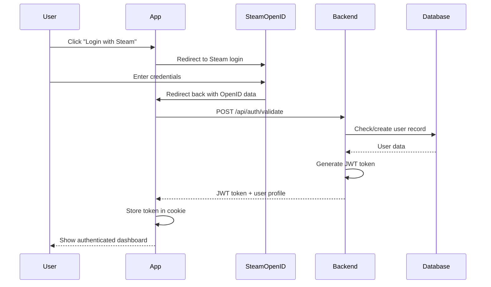
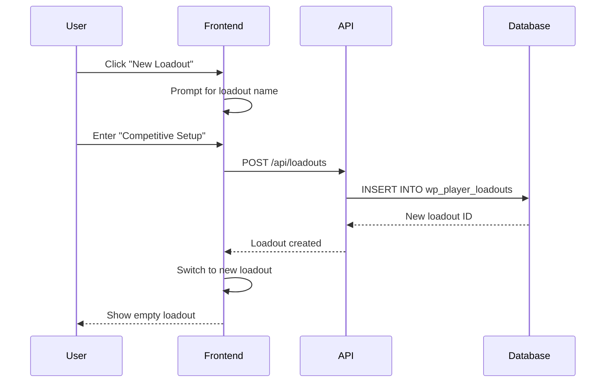
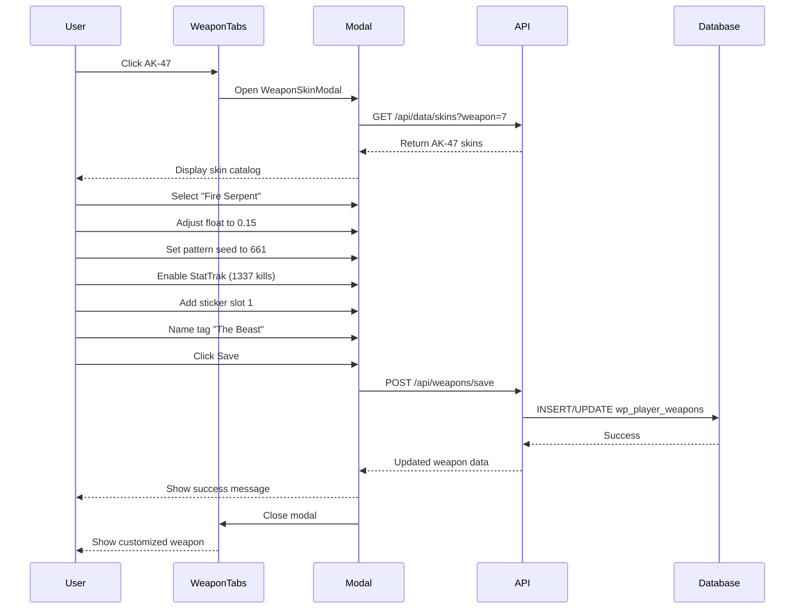
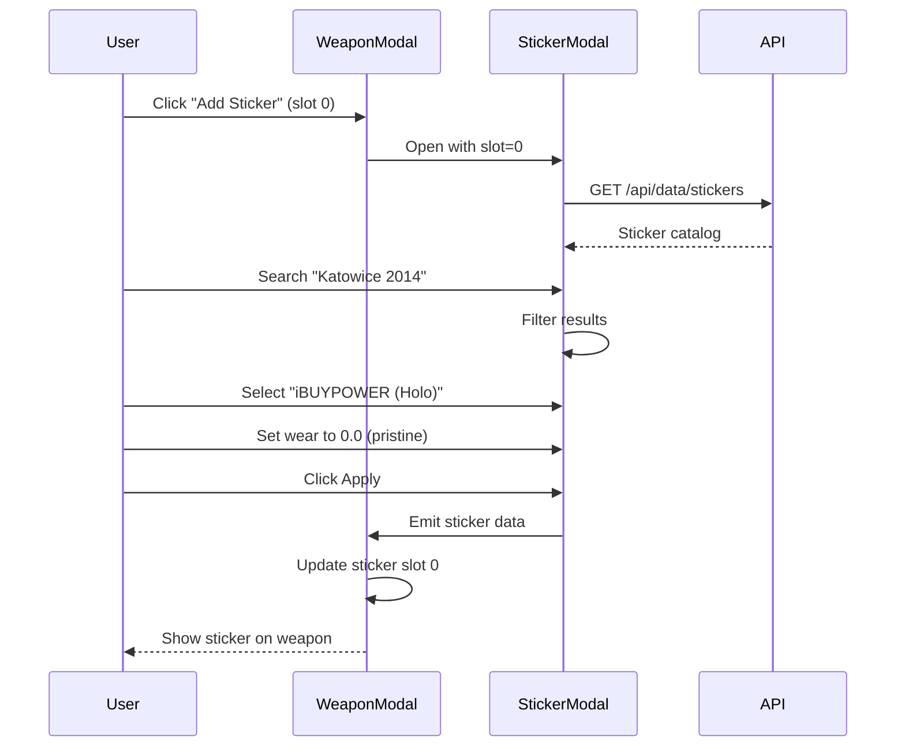
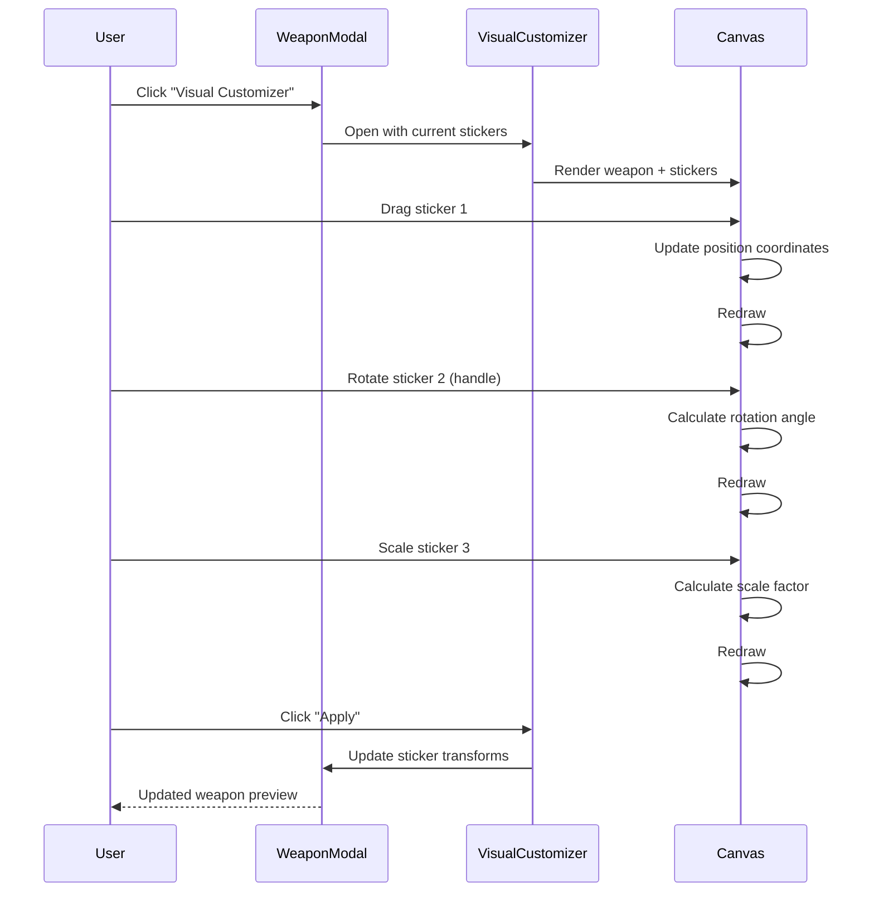
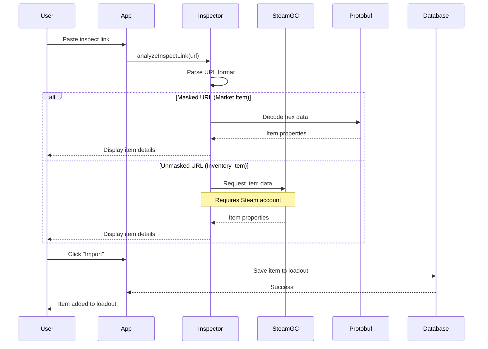
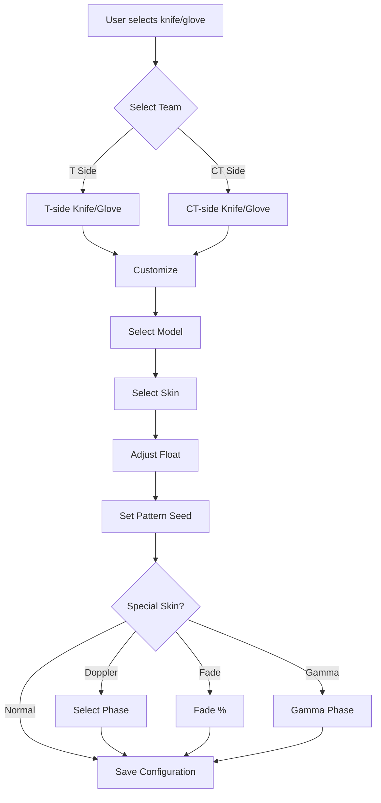

# How It Works

## User Flows and Core Features

This document explains the key user journeys and how the CS2Inspect application works from a user's perspective, with technical implementation details.

## Authentication Flow

### Steam Login Process



**Implementation Details**:

1. **Initiate Login**: User clicks Steam login button
2. **OpenID Flow**: Redirects to Steam's OpenID provider
3. **Callback**: Steam redirects back with verified Steam ID
4. **Token Generation**: Backend creates JWT with user's Steam ID
5. **Persistence**: JWT stored in secure HTTP-only cookie
6. **Session**: Token valid for 7 days (configurable via `JWT_EXPIRY`)

**Code References**:
- Frontend: `services/steamAuth.ts`
- Backend: `server/api/auth/validate.ts`
- Middleware: `server/middleware/auth.ts`

---

## Loadout Management Flow

### Creating a New Loadout



**Features**:
- Multiple loadouts per user (unlimited)
- Each loadout has independent weapon/knife/glove configurations
- Quick switch between loadouts
- Rename and delete loadouts

**Code References**:
- Store: `stores/loadoutStore.ts`
- API: `server/api/loadouts/index.ts`
- Component: `components/LoadoutSelector.vue`

---

## Weapon Customization Flow

### Selecting and Customizing a Weapon Skin



**Step-by-Step Process**:

1. **Weapon Selection**: User selects weapon category (Rifles) and specific weapon (AK-47)
2. **Modal Opens**: `WeaponSkinModal.vue` displays with current weapon data
3. **Skin Selection**: Browse skins, search by name, filter by collection
4. **Customization**:
   - **Float Value**: Slider from 0.00 (Factory New) to 1.00 (Battle-Scarred)
   - **Pattern Seed**: 0-1000, affects pattern placement (important for Case Hardened, Fade, etc.)
   - **StatTrak™**: Toggle on/off, set kill count
   - **Name Tag**: Custom weapon name (max 20 characters)
   - **Stickers**: Up to 5 sticker slots (weapons vary)
   - **Keychain**: Attach keychain (CS2 feature)
5. **Preview**: Real-time preview of customization
6. **Save**: Persist to database, update loadout

**Code References**:
- Component: `components/WeaponSkinModal.vue`
- API: `server/api/weapons/save.ts`
- Types: `types/business/items.ts` (`WeaponConfiguration`)

---

## Sticker Application Flow

### Adding Stickers to Weapons



**Sticker Features**:
- Thousands of stickers available
- Search and filter by tournament, team, capsule
- Sticker wear: Pristine, Scratched (0.0 - 1.0)
- Position on weapon (up to 5 slots depending on weapon)
- Remove/replace stickers

**Special Cases**:
- **Tournament Stickers**: Katowice 2014, Cologne 2015, etc.
- **Team Stickers**: Liquid, FaZe, NAVI, etc.
- **Autograph Stickers**: Player signatures
- **Holo/Foil Effects**: Special finishes

**Code References**:
- Component: `components/StickerModal.vue`
- API: `server/api/data/stickers.ts`

---

## Visual Customizer Flow

### Advanced Sticker Positioning



**Visual Customizer Features**:
- Canvas-based editing
- Drag and drop sticker positioning
- Rotation controls (0-360°)
- Scale adjustment
- Multi-layer management (sticker order)
- Undo/redo support
- Real-time preview
- Export as image

**Technical Implementation**:
- HTML5 Canvas API
- Touch and mouse event handling
- Transform matrices for rotation/scale
- Hit detection for selection
- Image caching for performance

**Code References**:
- Component: `components/VisualCustomizerModal.vue`

---

## Inspect Link Processing

### Importing Items from CS2



**Supported URL Formats**:

1. **Full Steam URL**:
   ```
   steam://rungame/730/76561202255233023/+csgo_econ_action_preview%20{data}
   ```

2. **Command Format**:
   ```
   csgo_econ_action_preview {data}
   ```

3. **Short Format**:
   ```
   +csgo_econ_action_preview {data}
   ```

4. **Raw Hex Data** (masked):
   ```
   00BF69A1E8...
   ```

5. **Unmasked Format** (inventory):
   ```
   S76561198012345678A123456789D123456789
   ```

**Processing Steps**:

1. **URL Analysis**: Identify URL type (masked vs unmasked)
2. **Data Extraction**:
   - **Masked**: Decode protobuf-encoded hex data
   - **Unmasked**: Query Steam Game Coordinator for item data
3. **Property Extraction**:
   - Weapon definition index (defindex)
   - Paint index (skin ID)
   - Paint seed (pattern)
   - Paint wear (float value)
   - StatTrak data
   - Stickers (positions, IDs, wear)
   - Keychains
   - Name tags
4. **Validation**: Verify item data integrity (CRC32 checksum)
5. **Display**: Show item preview with all properties
6. **Import**: Option to save to user's loadout

**Code References**:
- Composable: `composables/useInspectItem.ts`
- Backend: `server/api/inspect.ts`
- Protobuf: `server/utils/csinspect/protobuf-decoder.ts`
- Steam Client: `server/utils/csinspect/steamClient.ts`

---

## Knife and Glove Customization

### Special Considerations



**Knife-Specific Features**:
- StatTrak™ support (knives can have StatTrak)
- Name tags
- Doppler phases (Phase 1-4, Ruby, Sapphire, Black Pearl)
- Gamma Doppler phases
- Fade percentage calculation
- Autotronic patterns

**Glove-Specific Features**:
- No StatTrak support
- No name tags
- Team-based selection (T/CT)
- Different wear ranges per glove type

**Code References**:
- Knives: `components/KnifeSkinModal.vue`
- Gloves: `components/GloveSkinModal.vue`
- Tabs: `components/KnifeTabs.vue`, `components/GloveTabs.vue`

---

## Agent Selection

### Team-Based Agents

**Process**:
1. Select team (Terrorist or Counter-Terrorist)
2. Browse agents by faction
3. Select agent
4. Save to loadout

**Agent Categories**:

**Terrorist Factions**:
- Phoenix
- Elite Crew
- Guerrilla Warfare
- Professionals

**Counter-Terrorist Factions**:
- FBI
- GIGN
- SAS
- SWAT
- GSG-9

**Code References**:
- Component: `components/AgentTabs.vue`
- Page: `pages/agents/index.vue`
- API: `server/api/data/agents.ts`

---

## Music Kit Selection

**Features**:
- Browse all available music kits
- Preview audio samples (where available)
- View artist and track information
- Select active music kit for loadout

**Popular Music Kits**:
- Various artists (AWOLNATION, Feed Me, etc.)
- StatTrak™ music kits (count MVPs)
- Special event music kits

**Code References**:
- Component: `components/MusicKitTabs.vue`
- Page: `pages/music-kits/index.vue`

---

## Pin Collection Management

**Features**:
- View all collectible pins
- Add pins to collection
- Organize pin showcase
- Display rarity information

**Pin Categories**:
- Series 1, 2, 3 pins
- Operation pins
- Tournament pins
- Special event pins

**Code References**:
- Component: `components/PinTabs.vue`
- Page: `pages/pins/index.vue`

---

## Data Persistence

### Auto-Save Behavior

**Client-Side**:
- Inspect link data cached in `localStorage`
- Language preference persisted
- Theme settings stored
- Last active loadout remembered

**Server-Side**:
- All customizations saved to database
- Real-time updates on changes
- Loadout configurations persisted
- User preferences stored

**Database Tables**:
```sql
wp_player_loadouts        -- Loadout metadata
wp_player_weapons          -- Weapon customizations
wp_player_knifes           -- Knife customizations
wp_player_gloves           -- Glove customizations
wp_player_agents           -- Agent selections
wp_player_pins             -- Pin collections
```

---

## Error Handling

### Common Error Scenarios

1. **Authentication Errors**:
   - Invalid/expired JWT token → Redirect to login
   - Steam API unavailable → Show error message

2. **Inspect Link Errors**:
   - Invalid URL format → Validation error
   - Steam GC timeout → Retry mechanism
   - Unmasked URL without Steam account → Inform user

3. **Save Errors**:
   - Database connection failure → Show error, retry
   - Validation failures → Highlight invalid fields
   - Network errors → Queue for retry

4. **Asset Loading Errors**:
   - Missing skin images → Fallback placeholder
   - API timeout → Cached data used
   - Sticker images 404 → Default icon

**Code References**:
- Error boundaries in components
- Try-catch blocks in composables
- API error responses standardized
- Toast notifications for user feedback

---

## Performance Optimizations

### Caching Strategy

1. **Static Data**:
   - Skins, agents, stickers cached on first load
   - Refreshed only on version changes
   - Stored in Pinia store + localStorage

2. **User Data**:
   - Loadout data cached after fetch
   - Optimistic updates for instant feedback
   - Background sync to server

3. **Images**:
   - Lazy loading for item images
   - Browser cache leveraged
   - CDN delivery (if configured)

### Loading States

- Initial page load: Preloader component
- Data fetching: Skeleton loaders
- Button actions: Loading spinners
- Background operations: Silent updates

**Code References**:
- Component: `components/SitePreloader.vue`
- Loading states in all async operations

---

## Internationalization

### Language Support

**Supported Languages**:
- English (en-US) - Default
- German (de-DE)
- Russian (ru-RU)

**Translation Coverage**:
- UI labels and buttons
- Error messages
- Item names (where available)
- Form validation messages

**How It Works**:
```vue
<template>
  <button>{{ t('save') }}</button>
  <p>{{ t('errors.invalidFloat') }}</p>
</template>

<script setup>
const { t } = useI18n()
</script>
```

**Translation Files**:
```
locales/
├── en.json    # English translations
├── de.json    # German translations
└── ru.json    # Russian translations
```

**Code References**:
- Config: `nuxt.config.ts` (i18n section)
- Component: `components/LanguageSwitcher.vue`
- Translations: `locales/` directory

---

## Related Documentation

- [Architecture](architecture.md) - System architecture
- [Components](components.md) - Component reference
- [API Reference](api.md) - API documentation
- [Setup Guide](setup.md) - Development setup
