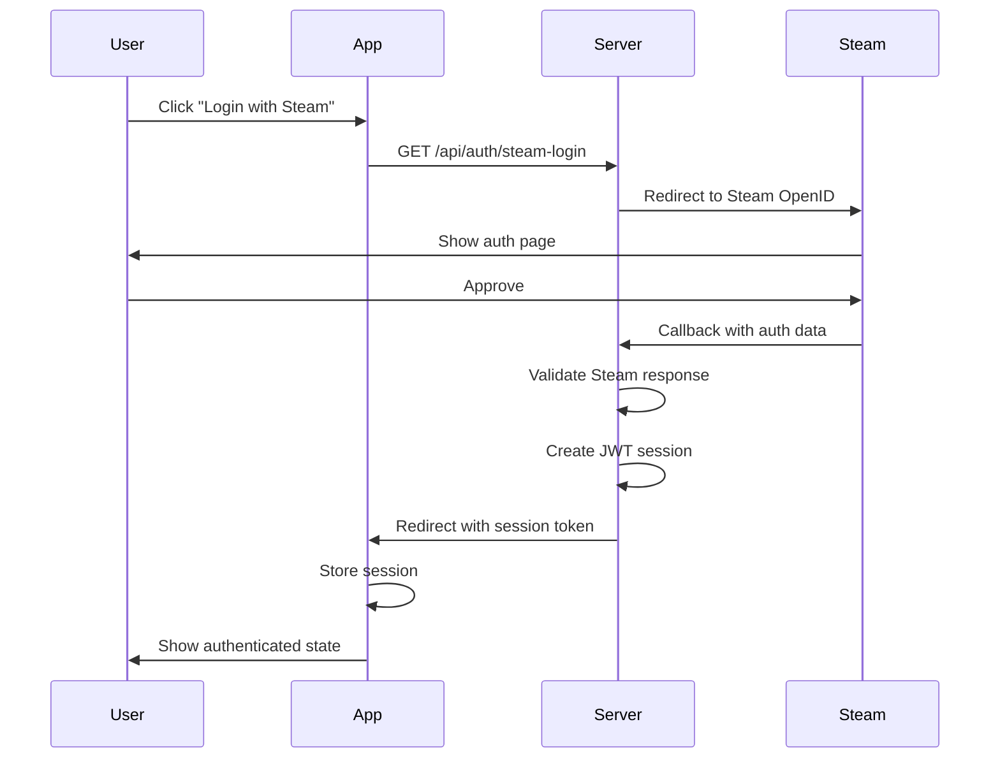

# Backend & Database Architecture <Badge type="info" text="Server-Side" />

Detailed documentation of the CS2Inspect backend architecture and database schema.

## Backend Architecture

The backend uses Nitro server (part of Nuxt 4) for API routes and server-side logic.

### API Structure

```
server/
├── api/
│   ├── admin/                        # Admin panel endpoints
│   │   ├── activity-log.get.ts       # Admin action audit log
│   │   ├── admins/
│   │   │   ├── [steamId].delete.ts   # Remove admin
│   │   │   ├── index.get.ts          # List admins
│   │   │   └── index.post.ts         # Add admin
│   │   ├── settings/
│   │   │   ├── index.get.ts          # Get app settings
│   │   │   └── index.put.ts          # Update setting
│   │   ├── stats/
│   │   │   ├── activity.get.ts       # Activity analytics
│   │   │   ├── items.get.ts          # Item statistics
│   │   │   ├── overview.get.ts       # Dashboard overview
│   │   │   └── users.get.ts          # Top users
│   │   └── users/
│   │       ├── [steamId].ban.post.ts   # Ban user
│   │       ├── [steamId].delete.ts     # Delete user data
│   │       ├── [steamId].get.ts        # User details
│   │       ├── [steamId].unban.post.ts # Unban user
│   │       └── index.get.ts            # List users
│   ├── auth/
│   │   └── validate.ts               # JWT session validation
│   ├── data/
│   │   ├── agents.ts                 # Agent data
│   │   ├── collectibles.ts           # Collectible/pin data
│   │   ├── keychains.ts              # Keychain data
│   │   ├── musickits.ts              # Music kit data
│   │   ├── skins.ts                  # Skin data
│   │   └── stickers.ts               # Sticker data
│   ├── health/
│   │   ├── details.ts                # Detailed health info
│   │   ├── history.ts                # Historical health data
│   │   ├── live.ts                   # Liveness probe
│   │   ├── proxy.ts                  # Proxy health check
│   │   └── ready.ts                  # Readiness probe
│   ├── inspect/
│   │   └── index.ts                  # Inspect URL processing
│   ├── items/
│   │   ├── gloves/
│   │   │   ├── index.ts              # Get gloves
│   │   │   └── save.post.ts          # Save glove config
│   │   ├── history/
│   │   │   ├── [itemType].get.ts     # Get item history
│   │   │   ├── restore.post.ts       # Restore from history
│   │   │   └── snapshot.post.ts      # Create snapshot
│   │   ├── knives/
│   │   │   ├── index.ts              # Get knives
│   │   │   └── save.post.ts          # Save knife config
│   │   ├── pins/
│   │   │   └── index.ts              # Get pins
│   │   └── weapons/
│   │       ├── [type].ts             # Get weapons by category
│   │       └── save.post.ts          # Save weapon config
│   ├── loadouts/
│   │   ├── [id].delete.ts            # Delete loadout
│   │   ├── [id].put.ts               # Update loadout
│   │   ├── activate.post.ts          # Activate loadout
│   │   ├── clear.post.ts             # Clear loadout items
│   │   ├── default.post.ts           # Set default loadout
│   │   ├── duplicate.post.ts         # Duplicate loadout
│   │   ├── equipped.get.ts           # Get equipped loadout
│   │   ├── import.post.ts            # Import loadout
│   │   ├── index.get.ts              # Get all loadouts
│   │   ├── index.post.ts             # Create loadout
│   │   ├── select.post.ts            # Select loadout
│   │   └── share.post.ts             # Share loadout
│   └── proxy/
│       └── image.ts                  # Image proxy
├── middleware/
│   ├── 01.steam-auth.ts              # Steam OpenID auth
│   ├── 02.auth.ts                    # JWT validation
│   ├── 03.admin-auth.ts              # Admin authorization
│   └── 04.maintenance.ts             # Maintenance mode gate
├── database/
│   ├── schema/                       # Drizzle ORM schema
│   │   ├── admin.ts                  # Admin tables
│   │   ├── agents.ts                 # Agent table
│   │   ├── gloves.ts                 # Glove table
│   │   ├── health.ts                 # Health check tables
│   │   ├── itemHistory.ts            # Item history table
│   │   ├── knives.ts                 # Knife table
│   │   ├── loadouts.ts               # Loadout table
│   │   ├── music.ts                  # Music kit table
│   │   ├── pins.ts                   # Pin table
│   │   └── weapons.ts                # Weapon tables (4)
│   ├── adminHelpers.ts               # Admin DB operations
│   ├── client.ts                     # Database connection
│   ├── loadoutHelpers.ts             # Loadout DB operations
│   └── migrate.ts                    # Migration runner
└── utils/
    ├── database/                     # DB utility functions
    ├── validation/
    │   └── adminSchemas.ts           # Zod validation schemas
    └── constants.ts                  # Shared constants
```

### Authentication Flow



### Middleware

Middlewares execute in numbered order on every request:

**`01.steam-auth.ts`** — Steam OpenID Authentication:

- Handles Steam OpenID login flow and callback
- Validates Steam authentication responses
- Creates user sessions

**`02.auth.ts`** — JWT Authentication:

- Validates JWT tokens from cookies/headers
- Checks session expiry
- Attaches `event.context.auth` with `steamId`
- Rejects unauthorized requests to protected routes

**`03.admin-auth.ts`** — Admin Authorization:

- Intercepts `/api/admin/*` routes only
- Checks `admin_users` table for the authenticated Steam ID
- Sets `event.context.admin` with `{ steamId, role, permissions }`
- Returns 401 (not authenticated) or 403 (not admin)

**`04.maintenance.ts`** — Maintenance Mode Gate:

- Checks `MAINTENANCE_MODE` from app settings cache
- Allows `/api/admin/*`, `/api/public/*`, Steam/auth internals, and locale routes
- Returns `503 Service Unavailable` for non-admin requests while maintenance is active
- Admin users bypass maintenance restrictions

### CS2 Integration

**Libraries Used**:

- `cs2-inspect-lib` - Parse inspect URLs and extract item data
- `node-cs2` - Steam Game Coordinator integration
- `csgo-fade-percentage-calculator` - Fade pattern calculations

**Inspect URL Processing**:

1. Parse URL with `cs2-inspect-lib`
2. Extract protobuf data
3. Decode item parameters
4. Return structured item configuration

---

## Database Schema

CS2Inspect uses MariaDB with [Drizzle ORM](https://orm.drizzle.team/) for data storage. Schema definitions are in `server/database/schema/`.

### Core Tables

| Table                | Schema File   | Description                                                                                                                |
| -------------------- | ------------- | -------------------------------------------------------------------------------------------------------------------------- |
| `wp_player_loadouts` | `loadouts.ts` | Loadout metadata with team-specific selections (knife, glove, agent per side), share codes, default flag                   |
| `wp_player_pistols`  | `weapons.ts`  | Pistol configurations (defindex, paintindex, paintseed, paintwear, stattrak, nametag, 5 sticker JSON slots, keychain JSON) |
| `wp_player_rifles`   | `weapons.ts`  | Rifle configurations (same fields as pistols)                                                                              |
| `wp_player_smgs`     | `weapons.ts`  | SMG configurations (same fields as pistols)                                                                                |
| `wp_player_heavys`   | `weapons.ts`  | Heavy weapon configurations (same fields as pistols)                                                                       |
| `wp_player_knifes`   | `knives.ts`   | Knife configurations (defindex, paintindex, paintseed, paintwear, stattrak, nametag)                                       |
| `wp_player_gloves`   | `gloves.ts`   | Glove configurations (defindex, paintindex, paintseed, paintwear)                                                          |
| `wp_player_agents`   | `agents.ts`   | Agent selections per team                                                                                                  |
| `wp_player_music`    | `music.ts`    | Music kit selections                                                                                                       |
| `wp_player_pins`     | `pins.ts`     | Pin/collectible selections                                                                                                 |

### History & Health Tables

| Table                  | Schema File      | Description                                                          |
| ---------------------- | ---------------- | -------------------------------------------------------------------- |
| `item_history`         | `itemHistory.ts` | Version history snapshots for item configurations (supports restore) |
| `health_check_history` | `health.ts`      | Health check execution logs with status and latency                  |
| `health_check_config`  | `health.ts`      | Health check configuration (thresholds, enabled state)               |

### Admin Tables

| Table                | Schema File | Description                                                  |
| -------------------- | ----------- | ------------------------------------------------------------ |
| `admin_users`        | `admin.ts`  | Admin accounts with roles (admin/superadmin) and permissions |
| `banned_users`       | `admin.ts`  | User ban records with reason, duration, and active status    |
| `app_settings`       | `admin.ts`  | Application configuration key-value store                    |
| `admin_activity_log` | `admin.ts`  | Audit trail for admin actions                                |

See the [Admin Panel documentation](./admin.md#database-tables) for detailed admin table schemas.

### Database Relationships

```
wp_player_loadouts (identified by steamid)
  ├─── wp_player_pistols (1:many)
  ├─── wp_player_rifles (1:many)
  ├─── wp_player_smgs (1:many)
  ├─── wp_player_heavys (1:many)
  ├─── wp_player_knifes (1:2, T+CT)
  ├─── wp_player_gloves (1:2, T+CT)
  ├─── wp_player_agents (1:2, T+CT)
  ├─── wp_player_music (1:1)
  ├─── wp_player_pins (1:many)
  └─── item_history (1:many)

admin_users ──── admin_activity_log (1:many)
banned_users (standalone, referenced by steamid)
app_settings (standalone key-value store)
health_check_history / health_check_config (standalone)
```

### Migrations

**Automatic Migrations**: Database schema migrations run automatically on application startup via `server/database/migrate.ts`.

**Migration Files**: `server/database/drizzle/`

**Migration System**: Drizzle ORM migration runner that tracks executed migrations in the `__drizzle_migrations` table. Migrations run automatically on app startup via `server/database/migrate.ts`.

## Related Documentation

- **[Frontend Architecture](architecture-frontend.md)** - Client-side architecture
- **[Architecture Overview](architecture.md)** - System overview
- **[Deployment & Security](architecture-deployment.md)** - Production setup
- **[API Reference](api/)** - API endpoint documentation
