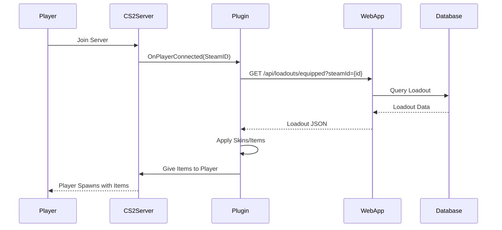

# CS2 Server Plugin Integration

## Overview

The CS2Inspect web application integrates with a CounterStrikeSharp plugin that applies player loadouts in-game. This guide explains how to install, configure, and use the plugin with your CS2Inspect web instance.

## Architecture



## Prerequisites

### Web Application

- CS2Inspect web app running and accessible
- Database configured and migrations applied
- At least one user with a loadout created

### CS2 Server

- Counter-Strike 2 Dedicated Server
- [CounterStrikeSharp](https://docs.cssharp.dev/) installed
- Server accessible from the internet (for web app communication)
- Admin access to server files

---

## Plugin Repository

The CS2Inspect plugin is maintained in a separate repository:

**GitHub**: [https://github.com/sak0a/CS2Inspect-Plugin](https://github.com/sak0a/CS2Inspect-Plugin)

---

## Installation

### Step 1: Install CounterStrikeSharp

If you haven't already, install CounterStrikeSharp on your CS2 server:

1. Download the latest release from [CounterStrikeSharp Releases](https://github.com/roflmuffin/CounterStrikeSharp/releases)
2. Extract to your CS2 server's `game/csgo` directory
3. Restart your server to load CounterStrikeSharp

### Step 2: Download CS2Inspect Plugin

```bash
# Download latest release
cd /path/to/cs2/game/csgo
wget https://github.com/sak0a/CS2Inspect-Plugin/releases/latest/download/CS2Inspect-Plugin.zip

# Extract to plugins directory
unzip CS2Inspect-Plugin.zip -d addons/counterstrikesharp/plugins/
```

Your directory structure should look like:
```
game/csgo/
└── addons/
    └── counterstrikesharp/
        └── plugins/
            └── CS2Inspect/
                ├── CS2Inspect.dll
                └── config/
                    └── config.json
```

### Step 3: Configure Plugin

Edit `addons/counterstrikesharp/plugins/CS2Inspect/config/config.json`:

```json
{
  "WebAppUrl": "https://your-cs2inspect-domain.com",
  "ApiKey": "your-api-key-here",
  "EnableLogging": true,
  "CacheLoadouts": true,
  "CacheDuration": 300,
  "RetryAttempts": 3,
  "RequestTimeout": 10
}
```

**Configuration Options**:

| Option | Type | Default | Description |
|--------|------|---------|-------------|
| `WebAppUrl` | string | Required | Base URL of your CS2Inspect web app |
| `ApiKey` | string | Optional | API key for authenticated requests |
| `EnableLogging` | boolean | `true` | Enable debug logging |
| `CacheLoadouts` | boolean | `true` | Cache loadouts to reduce API calls |
| `CacheDuration` | number | `300` | Cache duration in seconds |
| `RetryAttempts` | number | `3` | Number of retry attempts on API failure |
| `RequestTimeout` | number | `10` | HTTP request timeout in seconds |

### Step 4: Restart Server

```bash
# Restart your CS2 server
./srcds_run -game csgo +map de_dust2
```

Check the server console for:
```
[CS2Inspect] Plugin loaded successfully
[CS2Inspect] Web app URL: https://your-domain.com
[CS2Inspect] API connection: OK
```

---

## API Endpoint

The plugin communicates with the following endpoint:

### GET `/api/loadouts/equipped`

**Purpose**: Fetch the equipped loadout for a player.

**Query Parameters**:
- `steamId` (required): Player's Steam ID

**Request Example**:
```http
GET /api/loadouts/equipped?steamId=76561198012345678
Authorization: Bearer your-api-key-here
```

**Response** (Success):
```json
{
  "success": true,
  "message": "Equipped loadout retrieved successfully",
  "data": {
    "loadout": {
      "id": 1,
      "steamid": "76561198012345678",
      "name": "Competitive Setup",
      "active": 0,
      "is_default": 1,
      "selected_knife_t": 507,
      "selected_knife_ct": 507,
      "selected_glove_t": 5027,
      "selected_glove_ct": 5028,
      "selected_agent_ct": 5400,
      "selected_agent_t": 5600,
      "selected_music": 3,
      "created_at": "2024-01-01T00:00:00Z",
      "updated_at": "2024-01-15T10:30:00Z"
    },
    "items": {
      "weapons": [...],
      "knives": [...],
      "gloves": [...],
      "agents": [...],
      "music": {...}
    }
  }
}
```

**Response** (No Loadout):
```json
{
  "success": false,
  "message": "No loadout found for this user"
}
```

### Loadout Selection Logic

The API endpoint uses the following priority order:

1. **Default Loadout**: Loadout with `is_default = 1`
2. **Active Loadout**: Loadout with `active = 1`
3. **First Loadout**: First available loadout (by creation date)

This ensures players always have a loadout applied, even if they haven't explicitly set one as default.

---

## Plugin Features

### 1. **Automatic Loadout Application**

When a player joins the server:
- Plugin fetches their equipped loadout from the web app
- Applies all configured items (weapons, knives, gloves, agents, music)
- Items are given on player spawn

### 2. **Item Categories**

The plugin supports all CS2Inspect item categories:

#### Weapons
- Rifles (AK-47, M4A4, M4A1-S, AWP, etc.)
- Pistols (Desert Eagle, Glock-18, USP-S, etc.)
- SMGs (MP9, MP7, P90, etc.)
- Heavy Weapons (Nova, MAG-7, Negev, etc.)

**Customization**:
- Paint index (skin)
- Pattern seed
- Float value (wear)
- StatTrak™
- Name tags
- Stickers (up to 5)
- Keychains

#### Knives
- Team-specific knives (T/CT)
- All knife types (Karambit, Butterfly, Bayonet, etc.)
- Full customization (skin, pattern, float, StatTrak, name tag)

#### Gloves
- Team-specific gloves (T/CT)
- All glove types (Hand Wraps, Sport Gloves, etc.)
- Customization (skin, pattern, float)

#### Agents
- Team-specific agents (T/CT)
- All available CS2 agents

#### Music Kits
- Server-wide music kit selection
- StatTrak™ MVPs

### 3. **Performance Features**

#### Caching
- Loadouts are cached locally on the server
- Configurable cache duration (default: 5 minutes)
- Reduces API calls and improves performance

#### Retry Logic
- Automatic retries on API failures
- Exponential backoff
- Graceful degradation (default skins if API unavailable)

#### Async Loading
- Non-blocking API requests
- Players can join immediately
- Loadouts applied asynchronously

---

## Commands

### Admin Commands

```
!cs2inspect_reload - Reload plugin configuration
!cs2inspect_cache_clear - Clear loadout cache
!cs2inspect_status - Show plugin status
```

### Player Commands

```
!loadout - Display current loadout info
!loadout_refresh - Force refresh loadout from web app
```

---

## Configuration Examples

### Production Setup

```json
{
  "WebAppUrl": "https://cs2inspect.example.com",
  "ApiKey": "prod_key_1234567890abcdef",
  "EnableLogging": false,
  "CacheLoadouts": true,
  "CacheDuration": 600,
  "RetryAttempts": 5,
  "RequestTimeout": 15
}
```

### Development Setup

```json
{
  "WebAppUrl": "http://localhost:3210",
  "ApiKey": "",
  "EnableLogging": true,
  "CacheLoadouts": false,
  "CacheDuration": 0,
  "RetryAttempts": 1,
  "RequestTimeout": 5
}
```

### High-Traffic Server

```json
{
  "WebAppUrl": "https://cs2inspect.example.com",
  "ApiKey": "your-api-key",
  "EnableLogging": false,
  "CacheLoadouts": true,
  "CacheDuration": 1800,
  "RetryAttempts": 3,
  "RequestTimeout": 10
}
```

---

## Web App Configuration

### Enable Plugin Access

In your web app's `.env`:

```env
# Optional: Restrict API access to plugin
PLUGIN_API_KEY=your-api-key-here

# Optional: Whitelist plugin server IPs
ALLOWED_PLUGIN_IPS=1.2.3.4,5.6.7.8
```

### Database Requirements

The plugin requires these tables to exist:
- `loadouts` - User loadouts
- `weapons` - Weapon configurations
- `knives` - Knife configurations
- `gloves` - Glove configurations
- `agents` - Agent selections
- `music_kits` - Music kit selections

Ensure all migrations are run:

```bash
bun run db:push
```

---

## Troubleshooting

### Plugin Not Loading

**Symptoms**: Plugin doesn't appear in `css_plugins` list

**Solutions**:
1. Check CounterStrikeSharp is installed correctly
2. Verify file permissions: `chmod -R 755 addons/counterstrikesharp`
3. Check server console for error messages
4. Ensure .NET runtime is installed

### API Connection Failed

**Symptoms**: `[CS2Inspect] Failed to connect to web app`

**Solutions**:
1. Verify `WebAppUrl` is correct and accessible
2. Check firewall rules allow outbound HTTPS
3. Test API manually: `curl https://your-domain.com/api/health`
4. Check web app logs for request errors

### Loadouts Not Applying

**Symptoms**: Players join but don't receive skins

**Solutions**:
1. Enable logging: `"EnableLogging": true`
2. Check player has loadout in web app
3. Verify API endpoint returns data:
   ```bash
   curl "https://your-domain.com/api/loadouts/equipped?steamId=76561198012345678"
   ```
4. Check cache: Try `!loadout_refresh` command
5. Review server console for errors

### Skins Disappear After Respawn

**Symptoms**: Skins work on first spawn but not after

**Solutions**:
1. Plugin may be conflicting with other plugins
2. Disable other skin/weapon plugins
3. Check event hooks in plugin code
4. Update to latest plugin version

### Performance Issues

**Symptoms**: Server lag when players join

**Solutions**:
1. Enable caching: `"CacheLoadouts": true`
2. Increase cache duration: `"CacheDuration": 1800`
3. Reduce `RequestTimeout` to fail faster
4. Consider running web app on same network
5. Use CDN for static assets

---

## Advanced Configuration

### Custom API Endpoints

If you've customized the API endpoint path:

```json
{
  "WebAppUrl": "https://your-domain.com",
  "CustomEndpoint": "/v2/plugin/loadouts/equipped",
  "ApiKey": "your-key"
}
```

### Multiple Servers

For multiple CS2 servers sharing one web app:

**Server 1**:
```json
{
  "WebAppUrl": "https://shared-cs2inspect.com",
  "ApiKey": "server1_key",
  "ServerIdentifier": "us-west-1"
}
```

**Server 2**:
```json
{
  "WebAppUrl": "https://shared-cs2inspect.com",
  "ApiKey": "server2_key",
  "ServerIdentifier": "eu-central-1"
}
```

### Load Balancing

For high-traffic scenarios:

```json
{
  "WebAppUrls": [
    "https://cs2inspect-1.example.com",
    "https://cs2inspect-2.example.com"
  ],
  "LoadBalancingStrategy": "RoundRobin",
  "HealthCheckInterval": 60
}
```

---

## Monitoring

### Plugin Metrics

Enable metrics endpoint:

```json
{
  "EnableMetrics": true,
  "MetricsPort": 9000
}
```

Access metrics at `http://server-ip:9000/metrics`:

```
cs2inspect_loadouts_fetched_total 1234
cs2inspect_api_errors_total 5
cs2inspect_cache_hits_total 890
cs2inspect_cache_misses_total 344
cs2inspect_average_response_time_ms 45
```

### Log Files

Logs are written to:
```
addons/counterstrikesharp/logs/CS2Inspect/
├── cs2inspect_2026-01-25.log
├── cs2inspect_2026-01-24.log
└── errors.log
```

Example log entry:
```
[2026-01-25 12:34:56] [INFO] Player 76561198012345678 joined
[2026-01-25 12:34:57] [INFO] Fetching loadout from API...
[2026-01-25 12:34:58] [INFO] Loadout received: Competitive Setup (ID: 1)
[2026-01-25 12:35:00] [INFO] Applied 14 weapons, 2 knives, 2 gloves, 2 agents, 1 music kit
```

---

## Security

### API Key Best Practices

1. **Generate Strong Keys**: Use random, long keys
   ```bash
   openssl rand -hex 32
   ```

2. **Rotate Regularly**: Change keys every 90 days

3. **Restrict Access**: Use IP whitelisting
   ```env
   ALLOWED_PLUGIN_IPS=server1-ip,server2-ip
   ```

4. **Never Commit**: Don't commit keys to version control

### Rate Limiting

Configure rate limits in web app:

```env
# Limit plugin API requests
PLUGIN_RATE_LIMIT_MAX=100
PLUGIN_RATE_LIMIT_WINDOW=60000
```

### HTTPS Only

**Always use HTTPS** for production:

```json
{
  "WebAppUrl": "https://cs2inspect.example.com",
  "RequireHttps": true
}
```

---

## Performance Optimization

### 1. **Caching Strategy**

```json
{
  "CacheLoadouts": true,
  "CacheDuration": 1800,
  "CacheInvalidationOnUpdate": true
}
```

### 2. **Connection Pooling**

```json
{
  "HttpClientPoolSize": 10,
  "KeepAliveTimeout": 120
}
```

### 3. **Lazy Loading**

```json
{
  "LazyLoadWeapons": true,
  "PreloadCommonWeapons": true
}
```

### 4. **CDN for Assets**

Configure web app to use CDN:

```env
ASSETS_URL=https://cdn.example.com/cs2inspect
```

---

## Updates & Maintenance

### Updating the Plugin

```bash
# Backup current version
cp -r addons/counterstrikesharp/plugins/CS2Inspect /backup/

# Download latest version
wget https://github.com/sak0a/CS2Inspect-Plugin/releases/latest/download/CS2Inspect-Plugin.zip

# Extract (backup config first!)
cp addons/counterstrikesharp/plugins/CS2Inspect/config/config.json /tmp/
unzip -o CS2Inspect-Plugin.zip -d addons/counterstrikesharp/plugins/
cp /tmp/config.json addons/counterstrikesharp/plugins/CS2Inspect/config/

# Restart server
./restart-server.sh
```

### Changelog

Check release notes for breaking changes:
- [Plugin Releases](https://github.com/sak0a/CS2Inspect-Plugin/releases)
- [Web App Releases](https://github.com/sak0a/cs2inspect-web/releases)

---

## Related Documentation

- [API Reference](./api/) - Web app API documentation
- [Self-Hosting Guide](./self-hosting.md) - Deploy web app
- [Architecture](./architecture.md) - System architecture

---

## Support

### Getting Help

1. **Documentation**: Read this guide thoroughly
2. **GitHub Issues**: [Report bugs](https://github.com/sak0a/CS2Inspect-Plugin/issues)
3. **Discord**: Join community server (link in README)
4. **Wiki**: Check [plugin wiki](https://github.com/sak0a/CS2Inspect-Plugin/wiki)

### Common Questions

**Q: Can players change loadouts in-game?**
A: No, loadouts must be changed through the web app. Use `!loadout_refresh` to apply changes.

**Q: Do loadouts persist across map changes?**
A: Yes, loadouts are re-applied on every player spawn.

**Q: Can I use this on community servers?**
A: Yes, works on any CS2 server with CounterStrikeSharp.

**Q: Does this work with other skin plugins?**
A: May conflict. Disable other skin plugins to avoid issues.

**Q: Is this VAC-safe?**
A: Yes, server-side plugins don't affect VAC status.

---

## Contributing

Contribute to the plugin:

1. Fork repository
2. Create feature branch
3. Make changes
4. Add tests
5. Submit pull request

See [Contributing Guide](https://github.com/sak0a/CS2Inspect-Plugin/blob/master/CONTRIBUTING.md)

---

## License

See plugin repository for license information.
