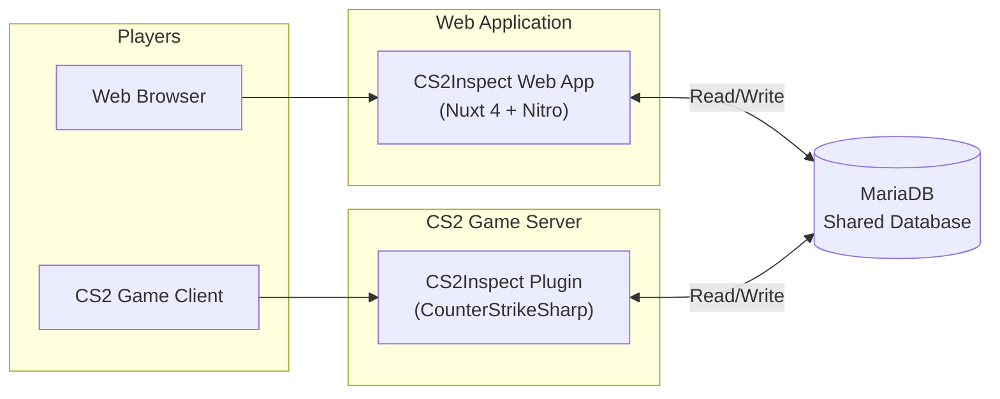
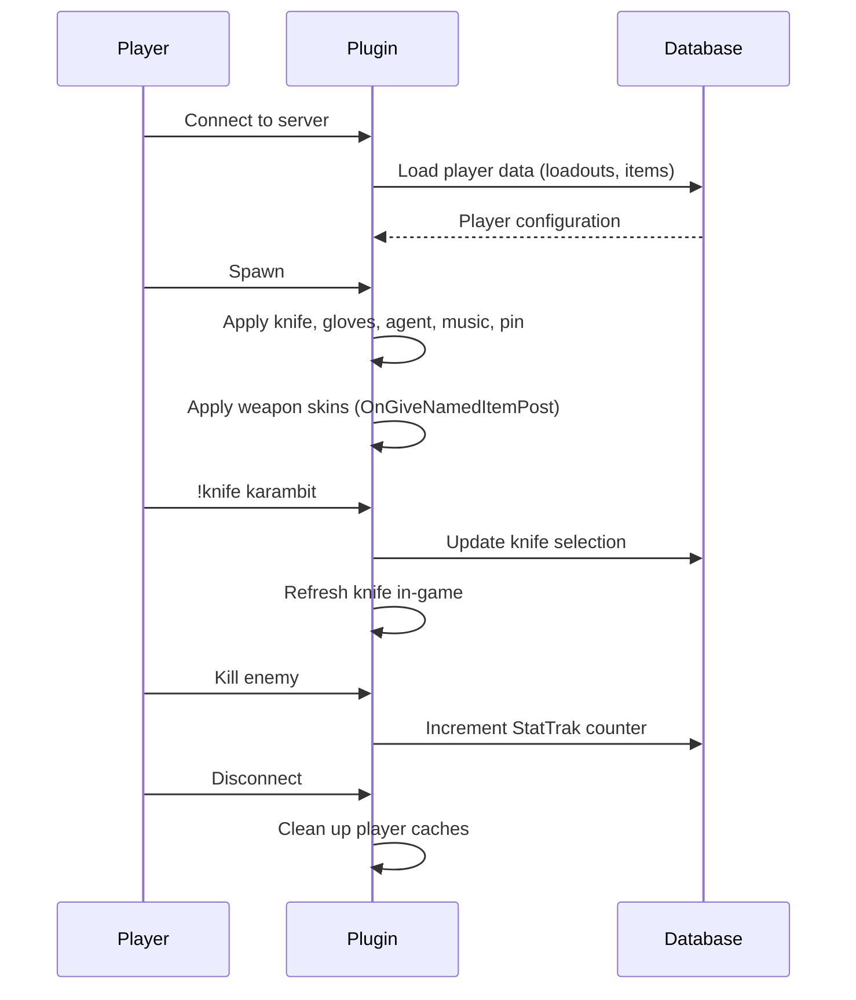

# CS2 Plugin Overview <Badge type="tip" text="Server Admin" />

## What is the CS2Inspect Plugin?

The CS2Inspect Plugin is a [CounterStrikeSharp](https://docs.cssharp.dev/) plugin built on .NET 8.0 that applies player loadouts configured on the web application directly in-game. When a player joins a CS2 server with the plugin installed, their custom skins, knives, gloves, agents, music kits, and pins are automatically applied.

::: info Key Architecture
The plugin and web application share the **same MariaDB database**. There is no HTTP API or network communication between them. Both systems read and write to the same `wp_player_*` tables independently.
:::

---

## Architecture: Shared Database



### How Data Flows

1. **Player configures loadout** on the web app (skins, knives, gloves, etc.)
2. Web app writes configuration to database tables (`wp_player_knifes`, `wp_player_rifles`, etc.)
3. **Player joins CS2 server** with the plugin installed
4. Plugin reads the player's active loadout from the same database tables
5. Plugin applies all configured items to the player in-game
6. **In-game commands** (`!knife`, `!glove`, `!g`, etc.) write changes back to the same database
7. Changes appear on the web app next time the player visits (and vice versa)

---

## Shared Database Tables

Both the web app and plugin operate on these tables:

| Table                | Description                                                                           |
| -------------------- | ------------------------------------------------------------------------------------- |
| `wp_player_loadouts` | Loadout metadata, selected item defindexes (knife, glove, agent, music, pin per team) |
| `wp_player_knifes`   | Knife customizations (paint, seed, wear, StatTrak, nametag)                           |
| `wp_player_gloves`   | Glove customizations (paint, seed, wear)                                              |
| `wp_player_rifles`   | Rifle skins (paint, seed, wear, StatTrak, nametag, stickers, keychain)                |
| `wp_player_pistols`  | Pistol skins (same schema as rifles)                                                  |
| `wp_player_smgs`     | SMG skins (same schema as rifles)                                                     |
| `wp_player_heavys`   | Heavy weapon skins (same schema as rifles)                                            |
| `wp_player_agents`   | Agent selections (defindex, agent name per team)                                      |
| `wp_player_music`    | Music kit selections                                                                  |
| `wp_player_pins`     | Pin selections                                                                        |

---

## Item Selection Modes

Every item type (knife, glove, agent, pin, music kit) supports three selection modes:

| Mode                  | DB Value        | Behavior                                                                                     |
| --------------------- | --------------- | -------------------------------------------------------------------------------------------- |
| **Player Inventory**  | `NULL`          | Preserves the player's real Steam inventory items. The plugin does not modify these items.   |
| **Default (Vanilla)** | `0`             | Forces vanilla CS2 items (basic knife, default gloves, default agent, no pin, no music kit). |
| **Custom**            | Positive number | Applies the custom item configured in the database.                                          |

::: tip Default for New Players
`NULL` (Player Inventory) is the default for new players. When a player joins for the first time, they see their real Steam inventory items until they configure something on the web app or via in-game commands.
:::

### Switching Modes

- **Web app**: Select "Player Inventory", "Default", or a specific item from the dropdown
- **In-game**: Use `!knife inventory`, `!knife default`, or `!knife <type>`

The plugin captures the player's real inventory items on connect via `GameInventoryCache`, enabling mid-game switching back to inventory items without requiring a respawn (for most item types).

---

## Installation

### Prerequisites

- Counter-Strike 2 Dedicated Server
- [CounterStrikeSharp](https://docs.cssharp.dev/) v339 or newer
- .NET 8.0 runtime
- MariaDB database (the same one used by the CS2Inspect web app)

### Step 1: Install CounterStrikeSharp

Download from the [official releases](https://github.com/roflmuffin/CounterStrikeSharp/releases) and extract to your CS2 server's `game/csgo` directory. Restart the server to verify it loads.

### Step 2: Download CS2Inspect Plugin

Download the latest release from the [plugin repository](https://github.com/sak0a/CS2Inspect-Plugin/releases) and extract it into your server directory.

Your directory structure should look like:

```
game/csgo/
└── addons/
    └── counterstrikesharp/
        ├── plugins/
        │   └── CS2Inspect/
        │       └── CS2Inspect.dll
        ├── configs/
        │   └── plugins/
        │       └── CS2Inspect/
        │           └── CS2Inspect.json
        └── gamedata/
            └── cs2inspect.json       # Required - plugin won't load without this
```

### Step 3: Configure Database Connection

Edit `configs/plugins/CS2Inspect/CS2Inspect.json` with your database credentials:

```json
{
  "DatabaseHost": "localhost",
  "DatabasePort": 3306,
  "DatabaseUser": "cs2inspect",
  "DatabasePassword": "your_password",
  "DatabaseName": "cs2inspect"
}
```

::: warning Same Database Required
These must point to the **same database** used by your CS2Inspect web application. The plugin reads from and writes to the same tables as the web app.
:::

For the full configuration reference, see [Plugin Configuration](./configuration.md).

### Step 4: Verify Required Files

The `gamedata/cs2inspect.json` file is **required**. The plugin will log an error and unload if this file is missing. It ships with each plugin release.

### Step 5: Start the Server

Restart your CS2 server. Check the console for:

```
[CS2Inspect] Plugin loaded successfully
```

If you see database errors, verify your credentials and that MariaDB is accessible from the game server.

---

## Features Summary

- **Automatic loadout application** on player connect and spawn
- **In-game commands** for knives, gloves, agents, music kits, pins, and weapons
- **Modular weapon configuration** (`!g`) with wear, paint, seed, StatTrak, nametag, stickers, keychains
- **Loadout switching** without reconnecting (`!loadout <name>`)
- **Per-knife shortcut commands** (`!karambit`, `!butterfly`, `!m9`, etc.)
- **Three selection modes** per item type (Player Inventory, Default, Custom)
- **Mid-game switching** between inventory and custom items
- **StatTrak kill tracking** on player death events
- **MVP music kit** application on round MVP
- **Permission system** with global and per-category gates
- **2-second command cooldown** to prevent spam
- **Localization** via JSON language files
- **Configurable feature toggles** to enable/disable individual item types

---

## Event Lifecycle



### Key Events

| Event                 | Action                                                            |
| --------------------- | ----------------------------------------------------------------- |
| `OnClientFullConnect` | Load player data from database (loadouts, items, selection modes) |
| `OnPlayerSpawn`       | Apply all loadout items (gloves, agent, music, pin, weapons)      |
| `OnGiveNamedItemPost` | Apply skin to weapon as it's given to the player                  |
| `OnPlayerTeam`        | Reapply team-specific items (knife, glove, agent)                 |
| `OnRoundMvp`          | Apply custom music kit for MVP                                    |
| `OnPlayerDeath`       | Increment StatTrak kill counter                                   |
| `OnPlayerDisconnect`  | Clean up all player caches                                        |

---

## Troubleshooting

### Plugin Not Loading

- Verify CounterStrikeSharp is installed and loading (`css_plugins` in console)
- Check that `gamedata/cs2inspect.json` exists in the correct directory
- Check server console for error messages
- Ensure .NET 8.0 runtime is available

### Items Not Applying

- Check database connection (look for errors in server console)
- Ensure the player has at least one loadout in the database
- Verify feature toggles are enabled in config (`KnifeEnabled`, `GloveEnabled`, etc.)
- Try `!knife` or `!glove` to manually refresh
- Check `!loadout_info` to see what's configured

### Database Connection Failed

- Verify host, port, username, password, and database name
- Ensure MariaDB is running and accepting connections
- Check firewall rules between game server and database server
- Try connecting manually: `mysql -h host -u user -p database`

### Loadouts Not Syncing

- Remember: web app and plugin both connect to the **same database**
- Web changes are visible to the plugin immediately (next command or respawn)
- Plugin changes are visible on the web app on next page load

---

## Related Documentation

- **[Plugin Commands](./commands.md)** — Complete command reference
- **[Plugin Configuration](./configuration.md)** — Full configuration options
- **[User Guide](../user-guide.md)** — End-user guide for the web app
- **[Architecture](../architecture.md)** — System architecture overview
- **[Self-Hosting Guide](../self-hosting.md)** — Deploy the web application
