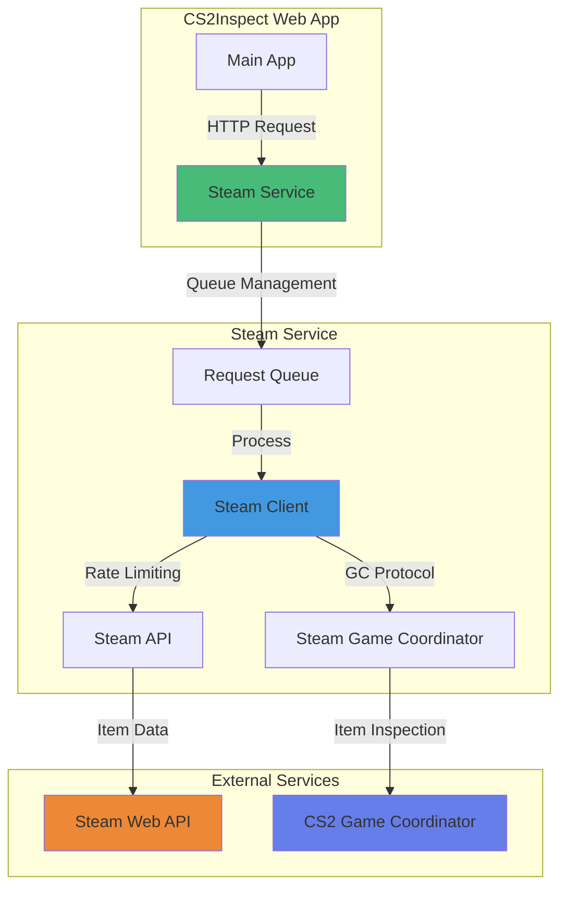
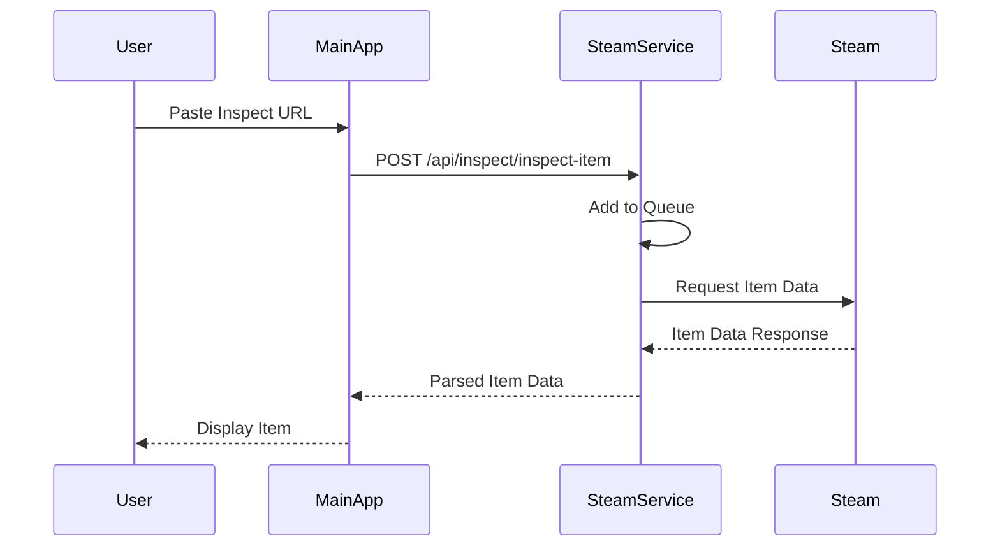

# Steam Service

## Overview

The Steam Service is a standalone microservice that provides shared access to a Steam account for CS2 item inspection across multiple applications. It acts as a bridge between the main CS2Inspect web application and Steam's Game Coordinator system.

## Architecture



## Key Features

### 1. **Shared Steam Account**
- Single Steam account instance accessible via REST API
- Eliminates need for multiple Steam accounts
- Centralized Steam session management

### 2. **Request Queue System**
- Manages concurrent requests with intelligent queuing
- Prevents Steam API rate limit violations
- FIFO (First In, First Out) queue processing
- Configurable queue size and timeout

### 3. **API Key Authentication**
- Secure access control via API keys
- Multiple API keys support
- Request logging with masked API keys for security

### 4. **Health Monitoring**
- Comprehensive health check endpoints
- Steam client status monitoring
- Queue status tracking
- Docker-ready health probes

### 5. **Error Handling**
- Detailed error responses with error codes
- Graceful degradation when Steam is unavailable
- Automatic retry logic for transient failures

## Technology Stack

- **Runtime**: Node.js (via tsx/ts-node)
- **Package Manager**: Bun
- **Web Framework**: Fastify 4
- **Language**: TypeScript
- **CS2 Integration**: cs2-inspect-lib v3.2.0
- **Testing**: Bun Test

### Why Node.js Runtime?

While Bun is used for package management and building, the service runs on Node.js because:
- `cs2-inspect-lib` uses Steam libraries that are more reliable on Node.js
- Production stability is prioritized over development speed
- Development uses `tsx watch` for hot-reload
- Production uses `node dist/index.js`

## Installation & Setup

### Prerequisites

- Node.js >= 20
- Bun >= 1.0.0
- Steam account credentials
- Steam Web API key

### Installation

```bash
cd services/steam-service
bun install
```

### Configuration

Create `.env` file based on `.env.example`:

```env
# Server Configuration
PORT=3001
NODE_ENV=production
HOST=0.0.0.0

# Steam Credentials
STEAM_USERNAME=your_steam_username
STEAM_PASSWORD=your_steam_password
STEAM_API_KEY=your_steam_api_key

# API Security
API_KEYS=key1,key2,key3

# CORS Configuration
CORS_ORIGINS=http://localhost:3210,https://your-domain.com

# Rate Limiting
RATE_LIMIT_MAX=100
RATE_LIMIT_WINDOW=60000

# Logging
LOG_LEVEL=info
LOG_API_REQUESTS=true
```

### Development

```bash
# Start development server with hot-reload
bun run dev

# Type checking
bun run type-check
```

### Production

```bash
# Build TypeScript
bun run build

# Start production server
bun start
```

## API Endpoints

### Authentication

All inspect endpoints require `X-API-Key` header:

```http
X-API-Key: your_api_key_here
```

### Inspect Endpoints

#### Create Inspect URL
```http
POST /api/inspect/create-url
Content-Type: application/json

{
  "itemType": "weapon",
  "defindex": 7,
  "paintindex": 253,
  "paintseed": 661,
  "paintwear": 0.15,
  "statTrak": true,
  "statTrakCount": 1337
}
```

#### Inspect Item (Requires Steam Client)
```http
POST /api/inspect/inspect-item
Content-Type: application/json

{
  "inspectUrl": "steam://rungame/730/..."
}
```

#### Decode Masked URL
```http
POST /api/inspect/decode-masked-only
Content-Type: application/json

{
  "inspectUrl": "steam://rungame/730/..."
}
```

#### Decode Hex Data
```http
POST /api/inspect/decode-hex-data
Content-Type: application/json

{
  "hexData": "0A0C..."
}
```

#### Validate Inspect URL
```http
POST /api/inspect/validate-url
Content-Type: application/json

{
  "inspectUrl": "steam://rungame/730/..."
}
```

#### Analyze URL Structure
```http
POST /api/inspect/analyze-url
Content-Type: application/json

{
  "inspectUrl": "steam://rungame/730/..."
}
```

### Health Endpoints

#### General Health
```http
GET /api/health
```

**Response:**
```json
{
  "status": "ok",
  "timestamp": "2026-01-25T00:00:00.000Z",
  "checks": {
    "steamClient": "ok",
    "queue": "ok"
  }
}
```

#### Readiness Probe
```http
GET /api/health/ready
```

**Response (Ready):**
```json
{
  "status": "ok",
  "ready": true
}
```

#### Liveness Probe
```http
GET /api/health/live
```

**Response:**
```json
{
  "status": "ok",
  "alive": true
}
```

### Status Endpoints

#### General Status
```http
GET /api/status
```

#### Steam Client Status
```http
GET /api/status/steam-client
```

**Response:**
```json
{
  "status": "connected",
  "uptime": 3600,
  "accountName": "steam_username"
}
```

#### Queue Status
```http
GET /api/status/queue
```

**Response:**
```json
{
  "size": 5,
  "processing": 1,
  "maxSize": 100
}
```

## Error Codes

| Code | Description | HTTP Status |
|------|-------------|-------------|
| `STEAM_CLIENT_UNAVAILABLE` | Steam client not initialized or connected | 503 |
| `INVALID_API_KEY` | API key authentication failed | 401 |
| `RATE_LIMIT_EXCEEDED` | Too many requests | 429 |
| `QUEUE_FULL` | Request queue is at capacity | 503 |
| `REQUEST_TIMEOUT` | Request processing timed out | 504 |
| `INVALID_INSPECT_URL` | Inspect URL format is invalid | 400 |
| `VALIDATION_ERROR` | Request validation failed | 400 |
| `INTERNAL_ERROR` | Internal server error | 500 |

## Testing

### Unit Tests (No Steam Account Required)

```bash
# Run all unit tests
bun test

# Run unit tests only
bun test:unit

# Watch mode
bun test --watch
```

**Unit Test Files:**
- `src/routes/inspect.test.ts` - Inspect endpoint tests
- `src/services/queue.test.ts` - Queue management tests
- `src/middleware/auth.test.ts` - Authentication tests
- `src/routes/health.test.ts` - Health check tests
- `src/utils/logger.test.ts` - Logger utility tests

### Integration Tests (Requires Steam Account)

```bash
# Set up test environment
export STEAM_USERNAME=your_test_account
export STEAM_PASSWORD=your_test_password
export STEAM_API_KEY=your_api_key
export STEAM_TEST_ENABLED=true

# Run integration tests
bun test:integration

# Or run all tests (unit + integration)
bun test:all
```

**Integration Test Files:**
- `src/routes/inspect.integration.test.ts` - Real Steam integration
- `src/services/steamClient.test.ts` - Steam client tests

## Deployment

### Docker Deployment

The steam-service can be deployed as a standalone Docker container:

```dockerfile
FROM oven/bun:latest

WORKDIR /app

# Copy package files
COPY package.json bun.lock ./

# Install dependencies
RUN bun install --production

# Copy source
COPY . .

# Build TypeScript
RUN bun run build

# Expose port
EXPOSE 3001

# Health check
HEALTHCHECK --interval=30s --timeout=5s --start-period=10s --retries=3 \
  CMD node -e "require('http').get('http://localhost:3001/api/health/live', (r) => process.exit(r.statusCode === 200 ? 0 : 1))"

# Start server
CMD ["bun", "start"]
```

### Git Subtree Deployment

The service is deployed using Git Subtree to the `steam-service-only` branch:

```bash
# Push updates from monorepo to deployment branch
git subtree push --prefix=services/steam-service origin steam-service-only

# Pull updates (if needed)
git subtree pull --prefix=services/steam-service origin steam-service-only
```

### Environment Variables for Production

```env
# Server
PORT=3001
NODE_ENV=production
HOST=0.0.0.0

# Steam (use dedicated account)
STEAM_USERNAME=<dedicated_bot_account>
STEAM_PASSWORD=<secure_password>
STEAM_API_KEY=<steam_web_api_key>

# Security
API_KEYS=<comma_separated_api_keys>

# CORS (restrict to your domains)
CORS_ORIGINS=https://your-domain.com,https://www.your-domain.com

# Rate Limiting (adjust as needed)
RATE_LIMIT_MAX=100
RATE_LIMIT_WINDOW=60000

# Logging
LOG_LEVEL=info
LOG_API_REQUESTS=true
```

## Integration with Main App

The main CS2Inspect web application communicates with the Steam Service via HTTP:

### 1. **Configuration**

In the main app's `.env`:

```env
STEAM_SERVICE_URL=http://localhost:3001
STEAM_SERVICE_API_KEY=your_api_key_here
```

### 2. **Client Integration**

The main app uses `server/utils/api/steamServiceClient.ts` to communicate:

```typescript
import { steamServiceClient } from '~/server/utils/api/steamServiceClient'

// Inspect an item
const result = await steamServiceClient.inspectItem(inspectUrl)

// Create inspect URL
const url = await steamServiceClient.createInspectUrl(itemData)
```

### 3. **Request Flow**



## Performance Considerations

### Request Queue

- **Default Queue Size**: 100 requests
- **Processing**: Sequential (one at a time)
- **Timeout**: 30 seconds per request
- **Rate Limiting**: 1.5s delay between Steam requests

### Scalability

For high-traffic scenarios, consider:
- Multiple Steam Service instances with different Steam accounts
- Load balancer distributing requests
- Redis-based shared queue for distributed processing
- Increased queue size and timeout values

### Caching

Currently, the service doesn't cache inspect results. Consider:
- Caching frequently inspected items
- Time-based cache expiration
- Cache invalidation strategy

## Security Best Practices

1. **API Keys**
   - Use strong, randomly generated API keys
   - Rotate API keys periodically
   - Never commit API keys to version control

2. **Steam Credentials**
   - Use a dedicated Steam account for the service
   - Enable Steam Guard (mobile authenticator)
   - Don't use your personal Steam account

3. **CORS**
   - Restrict `CORS_ORIGINS` to your domains only
   - Never use `*` in production

4. **Rate Limiting**
   - Adjust `RATE_LIMIT_MAX` based on your needs
   - Monitor for abuse patterns
   - Consider IP-based rate limiting

5. **Logging**
   - API keys are automatically masked in logs
   - Monitor logs for suspicious activity
   - Set `LOG_API_REQUESTS=true` for audit trail

## Troubleshooting

### Steam Client Won't Connect

**Symptoms**: `STEAM_CLIENT_UNAVAILABLE` errors

**Solutions**:
1. Check Steam credentials in `.env`
2. Ensure Steam Guard is properly configured
3. Check Steam server status
4. Review logs for connection errors
5. Try restarting the service

### Queue Full Errors

**Symptoms**: `QUEUE_FULL` error code

**Solutions**:
1. Increase queue size in configuration
2. Scale to multiple service instances
3. Implement request prioritization
4. Add caching layer

### Rate Limit Exceeded

**Symptoms**: 429 status codes

**Solutions**:
1. Increase `RATE_LIMIT_MAX`
2. Implement request throttling on client side
3. Use multiple API keys for different clients
4. Cache frequently requested data

### Timeout Issues

**Symptoms**: `REQUEST_TIMEOUT` errors

**Solutions**:
1. Increase request timeout in queue
2. Check Steam API response times
3. Monitor network latency
4. Consider implementing retry logic

## Monitoring & Observability

### Health Checks

Monitor these endpoints regularly:
- `/api/health` - Overall service health
- `/api/health/ready` - Readiness for traffic
- `/api/health/live` - Process liveness

### Metrics to Track

- Request queue length
- Average request processing time
- Steam client connection uptime
- API key usage patterns
- Error rates by endpoint
- Rate limit hit rate

### Logging

The service logs:
- All API requests (when enabled)
- Steam client connection events
- Queue operations
- Error conditions
- Health check results

### Alerts

Consider setting up alerts for:
- Steam client disconnections
- High error rates (>5%)
- Queue full conditions
- Unusual API key usage
- Health check failures

## Related Documentation

- [Main Architecture](../architecture.md) - Overall system architecture
- [API Reference](../api/) - Main app API documentation
- [Deployment Guide](../deployment.md) - Deployment strategies
- [Self-Hosting Guide](../self-hosting.md) - Self-hosting instructions

## Contributing

When contributing to the Steam Service:

1. **Write Tests**: Add unit tests for new features
2. **Update Documentation**: Keep this doc in sync with changes
3. **Follow TypeScript Standards**: Use proper typing
4. **Test Integration**: Run integration tests before merging
5. **Monitor Performance**: Profile changes for performance impact

## License

See the main project's LICENSE file.
