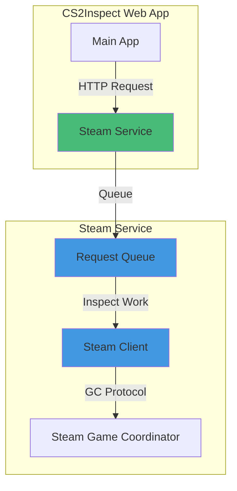
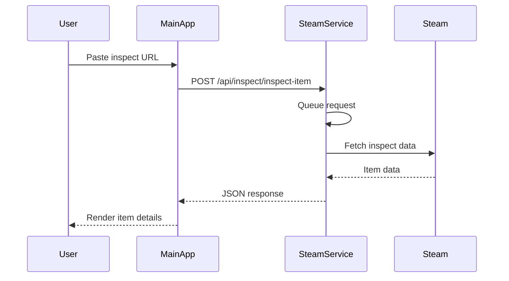

# Steam Service

## Overview

The Steam Service is a standalone microservice that provides shared Steam account access for CS2 inspect operations. It is designed to be called by the main CS2Inspect web app over HTTP.

## Architecture



## Key Features

- Shared Steam account instance with centralized session handling
- FIFO request queue to smooth bursts and protect Steam interactions
- API key authentication for all inspect endpoints (`X-API-Key`)
- Health and status endpoints for monitoring
- Structured error responses (`success`, `data`, `error`)

## Technology Stack

- Runtime: Node.js (`node dist/index.js` in production)
- Package manager/build/test: Bun
- Framework: Fastify 5
- Language: TypeScript
- CS2 integration: `cs2-inspect-lib`

### Runtime Notes

The service uses Bun tooling for install/build/test, but production execution is Node.js for Steam library stability.

## Installation & Setup

### Prerequisites

- Node.js >= 20
- Bun >= 1.0.0
- Steam account credentials (for unmasked inspect URLs)
- Steam Web API key

### Install

```bash
cd services/steam-service
bun install
```

### Environment

Create `.env` from `.env.example`:

```env
PORT=3211
HOST=0.0.0.0
NODE_ENV=development

STEAM_USERNAME=your_steam_username
STEAM_PASSWORD=your_steam_password
STEAM_API_KEY=your_steam_api_key

API_KEYS=default_api_key_here
CORS_ORIGINS=http://localhost:3210,http://localhost:3211

LOG_API_REQUESTS=true
LOG_LEVEL=info

RATE_LIMIT_MAX=100
RATE_LIMIT_WINDOW=60000

STEAM_RATE_LIMIT_DELAY=1500
STEAM_MAX_QUEUE_SIZE=100
STEAM_REQUEST_TIMEOUT=10000
STEAM_QUEUE_TIMEOUT=30000
```

### Run

```bash
# Development
bun run dev

# Build + production start
bun run build
bun start
```

## API Endpoints

### Auth

Inspect routes require API key auth:

```http
X-API-Key: your_api_key_here
```

Health/status routes are public (no API key required).

### Inspect Routes

- `POST /api/inspect/create-url`
- `POST /api/inspect/inspect-item`
- `POST /api/inspect/decode-masked-only`
- `POST /api/inspect/decode-hex-data`
- `POST /api/inspect/validate-url`
- `POST /api/inspect/analyze-url`

### Health Routes

- `GET /api/health`
- `GET /api/health/ready`
- `GET /api/health/live`

Example `GET /api/health` response:

```json
{
  "status": "ok",
  "ready": true,
  "checks": {
    "steam_client": {
      "status": "ok",
      "message": "Steam client is ready"
    },
    "queue": {
      "status": "ok",
      "message": "0 pending, 0 processing"
    }
  }
}
```

### Status Routes

- `GET /api/status`
- `GET /api/status/steam-client`
- `GET /api/status/queue`

Example `GET /api/status` response:

```json
{
  "steamClient": {
    "available": true,
    "status": "connected",
    "uptime": 1337000
  },
  "queue": {
    "pending": 0,
    "processing": 0,
    "maxSize": 100
  },
  "server": {
    "uptime": 1337000,
    "version": "1.0.0"
  }
}
```

## Error Codes

Common error codes:

- `MISSING_API_KEY`
- `INVALID_API_KEY`
- `RATE_LIMIT_EXCEEDED`
- `INVALID_REQUEST`
- `INVALID_INSPECT_URL`
- `INVALID_MASKED_URL`
- `DECODE_ERROR`
- `CREATE_URL_ERROR`
- `INSPECT_ERROR`
- `STEAM_CLIENT_UNAVAILABLE`
- `REQUEST_TIMEOUT`

## Testing

### Unit Tests

```bash
bun test
bun test:unit
```

### Integration Tests

```bash
STEAM_TEST_ENABLED=true bun test:integration
```

## Deployment

The service is designed to run as a standalone container or service instance and be consumed by the main app via `STEAM_SERVICE_URL` + `STEAM_SERVICE_API_KEY`.

Main app config example:

```env
STEAM_SERVICE_URL=http://localhost:3211
STEAM_SERVICE_API_KEY=your_api_key_here
```

## Integration Flow



## Operational Notes

- Queue backpressure is enforced via `STEAM_MAX_QUEUE_SIZE`
- Global HTTP rate limiting is controlled by `RATE_LIMIT_MAX` and `RATE_LIMIT_WINDOW`
- Steam client may initialize in the background on startup; service can run even if Steam is temporarily unavailable

## Related Documentation

- [Architecture](./architecture.md)
- [API Reference](./api/)
- [Self-Hosting Guide](./self-hosting.md)
