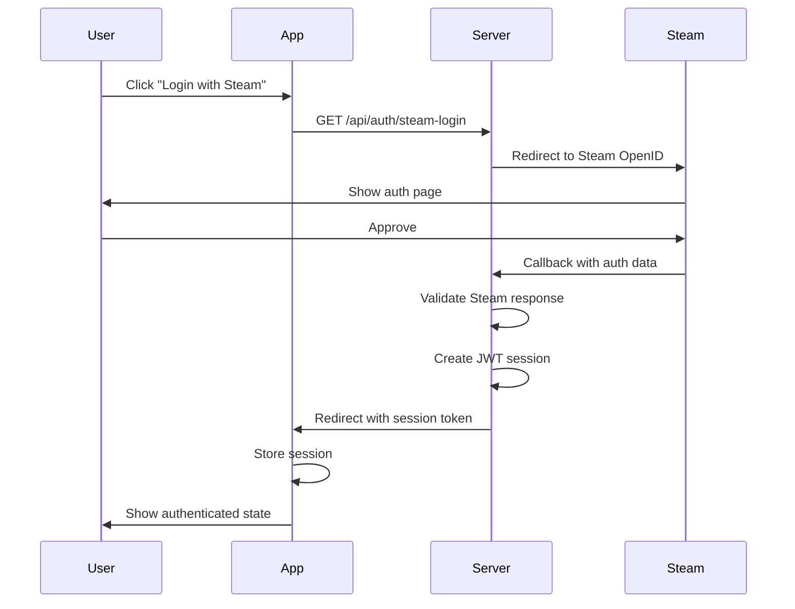

# Backend & Database Architecture <Badge type="info" text="Server-Side" />

Detailed documentation of the CS2Inspect backend architecture and database schema.

## Backend Architecture

The backend uses Nitro server (part of Nuxt 3) for API routes and server-side logic.

### API Structure

```
server/
├── api/
│   ├── auth/
│   │   ├── steam-login.get.ts      # Steam OpenID authentication
│   │   ├── steam-callback.get.ts   # Steam auth callback
│   │   ├── logout.post.ts          # Logout endpoint
│   │   └── validate.post.ts        # Session validation
│   ├── loadouts/
│   │   ├── index.get.ts            # Get all loadouts
│   │   ├── index.post.ts           # Create loadout
│   │   ├── [id].get.ts             # Get specific loadout
│   │   ├── [id].put.ts             # Update loadout
│   │   └── [id].delete.ts          # Delete loadout
│   ├── weapons/
│   │   ├── skins.get.ts            # Get weapon skins
│   │   ├── config.get.ts           # Get weapon config
│   │   └── config.post.ts          # Save weapon config
│   ├── inspect/
│   │   └── parse.post.ts           # Parse inspect URL
│   └── health/
│       └── index.get.ts            # Health check endpoint
├── middleware/
│   ├── auth.ts                     # Authentication middleware
│   └── cors.ts                     # CORS configuration
└── utils/
    ├── db.ts                       # Database connection
    ├── steam.ts                    # Steam API utilities
    └── inspect.ts                  # CS2 inspect utilities
```

### Authentication Flow



### Middleware

**Authentication Middleware** (`server/middleware/auth.ts`):
- Validates JWT tokens
- Checks session expiry
- Attaches user context to request
- Rejects unauthorized requests

**CORS Middleware** (`server/middleware/cors.ts`):
- Configures allowed origins
- Sets appropriate headers
- Handles preflight requests

### CS2 Integration

**Libraries Used**:
- `cs2-inspect-lib` - Parse inspect URLs and extract item data
- `node-cs2` - Steam Game Coordinator integration
- `csgo-fade-percentage-calculator` - Fade pattern calculations

**Inspect URL Processing**:
1. Parse URL with `cs2-inspect-lib`
2. Extract protobuf data
3. Decode item parameters
4. Return structured item configuration

---

## Database Schema

CS2Inspect uses MariaDB (MySQL-compatible) for data storage.

### Core Tables

#### `users`

Stores user authentication and profile data.

```sql
CREATE TABLE users (
  id BIGINT UNSIGNED PRIMARY KEY AUTO_INCREMENT,
  steam_id VARCHAR(20) UNIQUE NOT NULL,
  steam_name VARCHAR(100),
  avatar_url VARCHAR(255),
  created_at TIMESTAMP DEFAULT CURRENT_TIMESTAMP,
  updated_at TIMESTAMP DEFAULT CURRENT_TIMESTAMP ON UPDATE CURRENT_TIMESTAMP,
  INDEX idx_steam_id (steam_id)
);
```

#### `loadouts`

Stores loadout configurations.

```sql
CREATE TABLE loadouts (
  id BIGINT UNSIGNED PRIMARY KEY AUTO_INCREMENT,
  user_id BIGINT UNSIGNED NOT NULL,
  name VARCHAR(100) NOT NULL,
  is_active BOOLEAN DEFAULT FALSE,
  created_at TIMESTAMP DEFAULT CURRENT_TIMESTAMP,
  updated_at TIMESTAMP DEFAULT CURRENT_TIMESTAMP ON UPDATE CURRENT_TIMESTAMP,
  FOREIGN KEY (user_id) REFERENCES users(id) ON DELETE CASCADE,
  INDEX idx_user_id (user_id),
  INDEX idx_active (user_id, is_active)
);
```

#### `weapon_configs`

Stores weapon customization configurations.

```sql
CREATE TABLE weapon_configs (
  id BIGINT UNSIGNED PRIMARY KEY AUTO_INCREMENT,
  loadout_id BIGINT UNSIGNED NOT NULL,
  weapon_defindex INT NOT NULL,
  paint_index INT DEFAULT 0,
  paint_wear FLOAT DEFAULT 0.0,
  pattern_seed INT DEFAULT 0,
  stattrak BOOLEAN DEFAULT FALSE,
  stattrak_count INT DEFAULT 0,
  name_tag VARCHAR(50),
  stickers JSON,
  keychains JSON,
  created_at TIMESTAMP DEFAULT CURRENT_TIMESTAMP,
  updated_at TIMESTAMP DEFAULT CURRENT_TIMESTAMP ON UPDATE CURRENT_TIMESTAMP,
  FOREIGN KEY (loadout_id) REFERENCES loadouts(id) ON DELETE CASCADE,
  UNIQUE KEY unique_weapon_per_loadout (loadout_id, weapon_defindex),
  INDEX idx_loadout_id (loadout_id)
);
```

#### `knife_configs`

Stores knife configurations (T and CT side).

```sql
CREATE TABLE knife_configs (
  id BIGINT UNSIGNED PRIMARY KEY AUTO_INCREMENT,
  loadout_id BIGINT UNSIGNED NOT NULL,
  team ENUM('T', 'CT') NOT NULL,
  knife_defindex INT NOT NULL,
  paint_index INT DEFAULT 0,
  paint_wear FLOAT DEFAULT 0.0,
  pattern_seed INT DEFAULT 0,
  stattrak BOOLEAN DEFAULT FALSE,
  stattrak_count INT DEFAULT 0,
  name_tag VARCHAR(50),
  created_at TIMESTAMP DEFAULT CURRENT_TIMESTAMP,
  updated_at TIMESTAMP DEFAULT CURRENT_TIMESTAMP ON UPDATE CURRENT_TIMESTAMP,
  FOREIGN KEY (loadout_id) REFERENCES loadouts(id) ON DELETE CASCADE,
  UNIQUE KEY unique_knife_per_team (loadout_id, team),
  INDEX idx_loadout_id (loadout_id)
);
```

#### `glove_configs`

Stores glove configurations (T and CT side).

```sql
CREATE TABLE glove_configs (
  id BIGINT UNSIGNED PRIMARY KEY AUTO_INCREMENT,
  loadout_id BIGINT UNSIGNED NOT NULL,
  team ENUM('T', 'CT') NOT NULL,
  glove_defindex INT NOT NULL,
  paint_index INT DEFAULT 0,
  paint_wear FLOAT DEFAULT 0.0,
  pattern_seed INT DEFAULT 0,
  created_at TIMESTAMP DEFAULT CURRENT_TIMESTAMP,
  updated_at TIMESTAMP DEFAULT CURRENT_TIMESTAMP ON UPDATE CURRENT_TIMESTAMP,
  FOREIGN KEY (loadout_id) REFERENCES loadouts(id) ON DELETE CASCADE,
  UNIQUE KEY unique_glove_per_team (loadout_id, team),
  INDEX idx_loadout_id (loadout_id)
);
```

#### `agent_configs`

Stores agent selections (T and CT side).

```sql
CREATE TABLE agent_configs (
  id BIGINT UNSIGNED PRIMARY KEY AUTO_INCREMENT,
  loadout_id BIGINT UNSIGNED NOT NULL,
  team ENUM('T', 'CT') NOT NULL,
  agent_defindex INT NOT NULL,
  created_at TIMESTAMP DEFAULT CURRENT_TIMESTAMP,
  updated_at TIMESTAMP DEFAULT CURRENT_TIMESTAMP ON UPDATE CURRENT_TIMESTAMP,
  FOREIGN KEY (loadout_id) REFERENCES loadouts(id) ON DELETE CASCADE,
  UNIQUE KEY unique_agent_per_team (loadout_id, team),
  INDEX idx_loadout_id (loadout_id)
);
```

#### `music_kit_configs`

Stores music kit selections.

```sql
CREATE TABLE music_kit_configs (
  id BIGINT UNSIGNED PRIMARY KEY AUTO_INCREMENT,
  loadout_id BIGINT UNSIGNED NOT NULL,
  music_kit_defindex INT NOT NULL,
  created_at TIMESTAMP DEFAULT CURRENT_TIMESTAMP,
  updated_at TIMESTAMP DEFAULT CURRENT_TIMESTAMP ON UPDATE CURRENT_TIMESTAMP,
  FOREIGN KEY (loadout_id) REFERENCES loadouts(id) ON DELETE CASCADE,
  UNIQUE KEY unique_music_kit_per_loadout (loadout_id),
  INDEX idx_loadout_id (loadout_id)
);
```

#### `pin_configs`

Stores pin collections.

```sql
CREATE TABLE pin_configs (
  id BIGINT UNSIGNED PRIMARY KEY AUTO_INCREMENT,
  loadout_id BIGINT UNSIGNED NOT NULL,
  pin_defindex INT NOT NULL,
  position INT DEFAULT 0,
  created_at TIMESTAMP DEFAULT CURRENT_TIMESTAMP,
  updated_at TIMESTAMP DEFAULT CURRENT_TIMESTAMP ON UPDATE CURRENT_TIMESTAMP,
  FOREIGN KEY (loadout_id) REFERENCES loadouts(id) ON DELETE CASCADE,
  INDEX idx_loadout_id (loadout_id)
);
```

### Database Relationships

```
users
  └─── loadouts (1:many)
        ├─── weapon_configs (1:many)
        ├─── knife_configs (1:2, T+CT)
        ├─── glove_configs (1:2, T+CT)
        ├─── agent_configs (1:2, T+CT)
        ├─── music_kit_configs (1:1)
        └─── pin_configs (1:many)
```

### Migrations

**Automatic Migrations**: Database schema migrations run automatically on application startup.

**Migration Files**: `server/database/migrations/`

**Migration System**: Custom migration runner using `mysql2` library.

## Related Documentation

- **[Frontend Architecture](architecture-frontend.md)** - Client-side architecture
- **[Architecture Overview](architecture.md)** - System overview
- **[Deployment & Security](architecture-deployment.md)** - Production setup
- **[API Reference](api.md)** - API endpoint documentation
