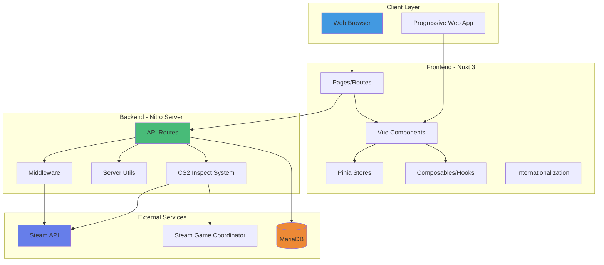

# Architecture <Badge type="info" text="System Design" />

This section documents the technical architecture of CS2Inspect. Choose a topic below for detailed information.

## Architecture Documentation

### System Overview <Badge type="tip" text="Start Here" />
**Current Page** - High-level system architecture and technology stack.

**Topics covered**:
- Technology stack (Frontend, Backend, DevOps)
- High-level architecture diagram
- Deployment architecture
- Core components overview

### Frontend Architecture <Badge type="tip" text="Client-Side" />
**[Frontend Architecture →](architecture-frontend.md)**

Detailed documentation of the client-side architecture.

**Topics covered**:
- Page and component structure
- State management (Pinia stores)
- Composables and utilities
- Internationalization (EN, DE, RU)
- Styling and theming
- Visual Customizer
- Performance optimizations

### Backend & Database <Badge type="info" text="Server-Side" />
**[Backend & Database →](architecture-backend.md)**

Server-side architecture and database schema.

**Topics covered**:
- API structure and endpoints
- Authentication flow
- Middleware configuration
- CS2 integration (inspect URLs, Steam GC)
- Complete database schema
- Table relationships
- Database migrations

### Deployment, Security & Performance <Badge type="danger" text="Production" />
**[Deployment & Security →](architecture-deployment.md)**

Production deployment, security measures, and performance optimization.

**Topics covered**:
- Deployment architecture and platforms
- Security best practices
- Authentication and API security
- Performance optimizations
- Scalability considerations
- Monitoring and logging
- Backup and recovery

---

## Quick Links

### For Developers

- **[Frontend Guide](architecture-frontend.md#component-architecture)** - Component structure
- **[API Reference](api.md)** - API endpoint documentation
- **[Database Schema](architecture-backend.md#database-schema)** - Database tables
- **[Setup Guide](setup.md)** - Development environment setup

### For DevOps

- **[Deployment Guide](deployment.md)** - Step-by-step deployment
- **[Security Guide](architecture-deployment.md#security-architecture)** - Security best practices
- **[Health Checks](HEALTH_CHECKS.md)** - Monitoring system
- **[Performance](architecture-deployment.md#performance-optimizations)** - Optimization strategies

---

## System Overview

CS2Inspect is a full-stack web application built with Nuxt 3 that allows Counter-Strike 2 players to customize and manage their in-game item loadouts. The application provides a comprehensive interface for weapon skins, knives, gloves, agents, music kits, and pins customization with real-time preview capabilities.

## Technology Stack

### Frontend <Badge type="tip" text="Modern Stack" />
- **Framework**: Nuxt 3 (Vue 3 + TypeScript)
- **UI Library**: Naive UI
- **Styling**: Tailwind CSS with custom SASS
- **State Management**: Pinia
- **Internationalization**: nuxt-i18n-micro (English, German, Russian)
- **Icons**: Iconify + Material Design Icons
- **Charts**: Chart.js + vue-chartjs (for health monitoring)

### Backend <Badge type="info" text="Node.js" />
- **Runtime**: Node.js with Nitro server
- **Database**: MariaDB (MySQL compatible)
- **Authentication**: Steam OpenID + JWT
- **CS2 Integration**: 
  - `cs2-inspect-lib` - CS2 item inspection
  - `node-cs2` - Steam Game Coordinator integration
  - `csgo-fade-percentage-calculator` - Fade pattern calculations

### DevOps <Badge type="warning" text="Production Ready" />
- **Build System**: Vite
- **Testing**: Vitest + Vue Test Utils
- **Linting**: ESLint
- **Package Manager**: npm
- **Containerization**: Docker + Docker Compose (with HEALTHCHECK)
- **Deployment**: Vercel (configured)
- **Health Monitoring**: Built-in health check system with status dashboard

## High-Level Architecture

::: tip Architecture Overview
This diagram shows how the different layers of the application communicate. Data flows from the browser through the Nuxt frontend to the Nitro backend, which then communicates with external services like Steam and the database.
:::
- Error logging to console
- Steam client connection status
- Database query logging
- Health check sampling and results

### Future Monitoring
- Application Performance Monitoring (APM)
- Error tracking (e.g., Sentry)
- User analytics
- Database query performance
- Steam API rate limit tracking
- Alerting system for health check failures

## Related Documentation

- [Components Guide](components.md) - Detailed component documentation
- [API Reference](api.md) - Complete API endpoint documentation
- [Setup Guide](setup.md) - Local development setup
- [Deployment Guide](deployment.md) - Production deployment
- [Health Checks](../HEALTH_CHECKS.md) - Health monitoring system documentation
