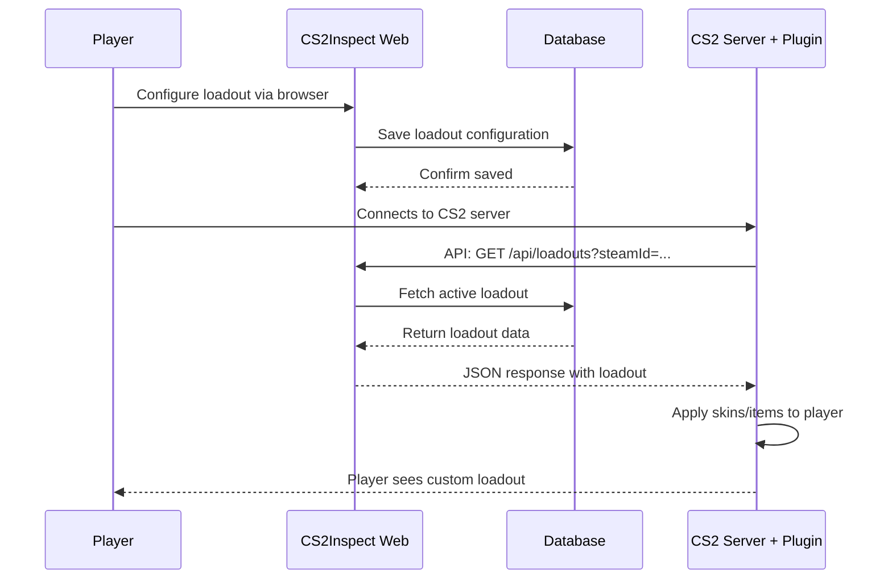

# CS2Inspect Plugin Integration <Badge type="info" text="CS:GO Plugin" />

## Overview

The **CS2Inspect Plugin** is a SourceMod plugin for Counter-Strike 2/CS:GO servers that integrates seamlessly with the CS2Inspect Web application. It allows players to use their customized weapon loadouts from the web interface directly in-game.

::: tip Integration Benefits
- **Seamless Experience**: Players configure loadouts on the web, use them in-game
- **Real-time Sync**: Loadouts sync instantly via API
- **Server-Side Validation**: All configurations validated server-side for security
- **No Client Downloads**: Works purely server-side using SourceMod
:::

## How It Works Together

### Web Application (This Project)
The CS2Inspect Web application serves as the **configuration interface** where players:
1. Authenticate via Steam
2. Create and manage multiple loadouts
3. Customize weapons, knives, gloves, agents, music kits, and pins
4. Preview changes in real-time
5. Save configurations to the database

### CS2Inspect Plugin (SourceMod)
The plugin runs on CS:GO/CS2 game servers and:
1. Queries the CS2Inspect Web API when a player joins
2. Fetches the player's active loadout from the database
3. Applies weapon skins, stickers, name tags, and wear values
4. Equips knives, gloves, agents, and other items
5. Syncs changes when players switch loadouts

## Architecture Flow



## Plugin Features

The CS2Inspect Plugin provides server-side functionality to:

### ✅ Weapon Customization
- **Skins**: Apply any weapon skin based on paint index
- **Wear Values**: Set float values (Factory New to Battle-Scarred)
- **Pattern Index**: Apply specific pattern variations (e.g., Case Hardened blue gems)
- **Stickers**: Apply up to 5 stickers per weapon with custom positions and wear
- **Name Tags**: Custom weapon names
- **StatTrak™**: Enable/disable StatTrak counter

### ✅ Equipment
- **Knives**: Any knife model with skin customization
- **Gloves**: Glove skins with wear values
- **Agents**: Player model/agent selection
- **Music Kits**: Background music customization
- **Pins**: Display collectible pins

### ✅ Loadout Management
- **Multiple Loadouts**: Players can have unlimited loadouts
- **Quick Switch**: Change active loadout via web or in-game menu
- **Persistence**: Loadouts saved per Steam ID
- **Default Weapons**: Configure server-wide defaults for new players

## API Integration

The plugin communicates with the web application through RESTful API endpoints:

### Authentication
The plugin uses a **server API key** configured in the plugin's config file:
```cpp
// plugin.cfg
cs2inspect_api_url "https://your-domain.com/api"
cs2inspect_api_key "your-server-api-key-here"
```

### Endpoints Used by Plugin

#### 1. Fetch Player Loadout
```http
GET /api/loadouts?steamId=STEAM_0:1:12345678
Authorization: Bearer <server-api-key>
```

**Response:**
```json
{
  "success": true,
  "data": {
    "loadoutId": 42,
    "loadoutName": "Competitive Setup",
    "weapons": [
      {
        "weapon": "weapon_ak47",
        "paintIndex": 524,
        "paintSeed": 661,
        "paintWear": 0.07,
        "stickers": [...]
      }
    ],
    "knife": { ... },
    "gloves": { ... },
    "agent": { ... }
  }
}
```

#### 2. Switch Active Loadout (Optional)
```http
POST /api/loadouts/select
Authorization: Bearer <server-api-key>
Content-Type: application/json

{
  "steamId": "STEAM_0:1:12345678",
  "loadoutId": 42
}
```

## Setup Instructions

### 1. Install the Plugin (Server Owners)

::: warning Private Repository
The CS2Inspect Plugin is currently in a **private repository**. Contact the project maintainer for access if you're interested in running it on your server.
:::

**Basic Installation:**
1. Install SourceMod on your CS:GO/CS2 server
2. Download the CS2Inspect plugin files
3. Place plugin files in `addons/sourcemod/plugins/`
4. Configure API settings in `cfg/sourcemod/plugin.cs2inspect.cfg`
5. Restart the server or load the plugin

### 2. Configure the Plugin

Edit `cfg/sourcemod/plugin.cs2inspect.cfg`:
```cpp
// API Configuration
cs2inspect_api_url "https://cs2inspect.yourdomain.com/api"
cs2inspect_api_key "your-secret-server-api-key"

// Plugin Settings
cs2inspect_enable "1"                    // Enable plugin
cs2inspect_update_on_spawn "1"           // Update loadout on player spawn
cs2inspect_allow_ingame_switch "1"       // Allow loadout switching via menu
cs2inspect_cache_duration "300"          // Cache loadouts for 5 minutes
cs2inspect_debug "0"                     // Debug logging (0 = off, 1 = on)
```

### 3. Generate Server API Key (Web Admin)

On the CS2Inspect Web application:
1. Navigate to **Admin Settings** (requires admin privileges)
2. Go to **Server API Keys** section
3. Click **Generate New Key**
4. Give it a name (e.g., "EU Server #1")
5. Copy the generated key and add it to your server config

::: tip Security
Server API keys have **read-only** access to loadout data. They cannot modify user data, ensuring player configurations remain secure.
:::

## Player Workflow

### Step 1: Configure Loadout on Web
1. Visit **https://cs2inspect.yourdomain.com**
2. Login with Steam
3. Create a new loadout or edit existing one
4. Customize weapons, skins, stickers, etc.
5. Save changes

### Step 2: Use In-Game
1. Connect to any server running the CS2Inspect Plugin
2. Loadout automatically applies when spawning
3. (Optional) Type `!loadout` in chat to switch loadouts via in-game menu

### Step 3: Update Anytime
- Changes made on the web are reflected in-game after:
  - Next spawn (if `cs2inspect_update_on_spawn` enabled)
  - Cache expires (default: 5 minutes)
  - Manual refresh via `!refresh` command

## Plugin Commands

Players can use these commands in-game:

| Command | Description |
|---------|-------------|
| `!loadout` | Open loadout selection menu |
| `!skins` | View current applied skins |
| `!refresh` | Force refresh loadout from web |
| `!ws` | Show weapon skin info in chat |

## Technical Details

### Data Flow
1. **Player joins server** → Plugin makes API request to fetch loadout
2. **Loadout received** → Plugin caches data locally
3. **Player spawns** → Cached loadout applied to spawned weapons
4. **Player switches loadout** → Plugin updates cache and reapplies

### Caching Strategy
- Loadouts cached in memory for configurable duration (default: 5 min)
- Reduces API calls and improves performance
- Cache invalidated when player manually refreshes
- Automatic refresh on map change (optional)

### Performance
- **API Latency**: Typical request ~50-200ms
- **Memory Usage**: ~2KB per cached loadout
- **Server Impact**: Negligible (<1% CPU usage)

## Troubleshooting

### Plugin Not Loading Loadouts

**Check:**
1. Verify API URL is correct in config
2. Ensure server API key is valid
3. Check server can reach the web application (firewall rules)
4. Enable debug logging: `cs2inspect_debug 1`
5. Check SourceMod error logs: `addons/sourcemod/logs/errors_*.log`

### Skins Not Applying

**Solutions:**
- Ensure player has a saved loadout on the web
- Verify weapon IDs match between web and plugin
- Check that the paint indexes are valid
- Try `!refresh` command to force reload

### API Connection Errors

**Common Issues:**
- **SSL Certificate**: Ensure your domain has valid HTTPS
- **Firewall**: Allow outbound HTTPS connections from game server
- **API Key**: Verify the key hasn't been revoked or expired

## Future Enhancements

Planned features for the plugin integration:

- [ ] **In-game loadout editor**: Basic skin selection via CS2 menus
- [ ] **Real-time sync**: WebSocket connection for instant updates
- [ ] **Loadout sharing**: Share loadouts with other players
- [ ] **Loadout presets**: Server-provided themed loadouts
- [ ] **Analytics**: Track most popular skins and loadout configurations

## Support & Contribution

### Getting Access
The CS2Inspect Plugin is currently **private**. If you're interested in:
- Running it on your server
- Contributing to development
- Reporting bugs or suggesting features

Please contact the project maintainer via:
- GitHub: [@sak0a](https://github.com/sak0a)
- Discord: *(Available in the main project README)*

### Contributing
Once you have access to the plugin repository:
1. Follow the plugin's contribution guidelines
2. Ensure changes are backward compatible with the web API
3. Test thoroughly on a development server before proposing changes
4. Submit pull requests with clear descriptions

## Related Documentation

- [API Reference](/api) - Complete web API documentation
- [Deployment Guide](/deployment) - Hosting the web application
- [How It Works](/how-it-works) - Understanding the web application architecture
- [Setup Guide](/setup) - Local development setup for the web app

---

::: info Plugin Repository
**Note**: The CS2Inspect Plugin is maintained in a separate private repository at `sak0a/CS2Inspect-Plugin`. This documentation describes the integration between the web application and the plugin. For plugin-specific documentation, refer to the plugin repository's README once you have access.
:::
